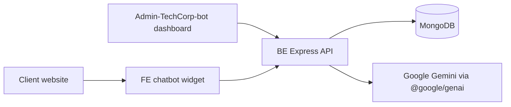
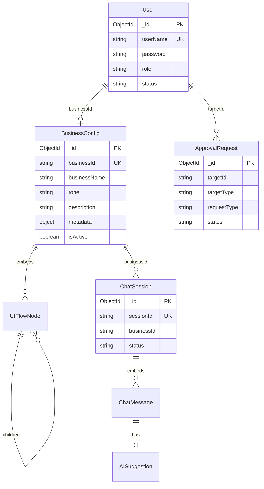

<div align="center">
  
  <h1>🌟 AI Chatbot Integration Platform</h1>
  <p><strong>A Next-Generation, Multi-Tenant AI Assistant for Businesses</strong></p>
  
  <p>
    
    
    
    
    
  </p>
</div>

<hr />

## 📖 Overview

The **AI Chatbot Integration Platform** is a robust, multi-tenant B2B solution designed to empower businesses with intelligent, context-aware conversational agents. Built on a modern microservices-inspired architecture, this platform allows multiple businesses to seamlessly configure, deploy, and manage their own bespoke AI chatbots without writing a single line of code.

Leveraging the power of **Google Gemini AI**, the system injects rich business context (product catalogs, custom instructions, and UI flows) directly into the AI's prompts, ensuring accurate and highly personalized responses for end-users.

## ✨ Core Features

* 🏢 **Multi-Tenant Architecture**: A single unified backend serves multiple isolated business instances securely.
* 🤖 **Context-Aware AI via Google Gemini**: Dynamic prompt engineering injects specific business guidelines, tones, and product metadata into the AI's context.
* 📊 **Comprehensive Admin Dashboard**: A sleek, React-based portal for administrators to approve accounts, monitor metrics, and manage system-wide settings.
* ⚙️ **No-Code Chatbot Configuration**: Businesses can define UI flows, customize chatbot behavior, and update product catalogs via a user-friendly wizard.
* 🔒 **Enterprise-Grade Security**: Implements strict Role-Based Access Control (RBAC), JWT authentication, request validation (Joi), and API rate-limiting.
* 📦 **Plug-and-Play React Widget**: A lightweight, embeddable React widget (`@ai-chatbot-platform/react`) ready to be integrated into any client website.

---

## 🛠️ Technology Stack

| Layer | Technologies Used | Purpose |
| :--- | :--- | :--- |
| **Backend (BE)** | Node.js, Express, Mongoose | High-performance HTTP RESTful API & ODM |
| **Database** | MongoDB | Highly flexible, schema-less document storage |
| **AI Engine** | Google Generative AI (`@google/genai`) | LLM for natural language processing & responses |
| **Frontend (Dashboard)** | React 19, TypeScript, Vite, Ant Design | Interactive management portal for Admins & Businesses |
| **Frontend (Widget)** | React, Zustand, Vite | Embeddable, lightweight client-side chat interface |
| **Security & Ops** | JWT, bcryptjs, Helmet, Winston | Authentication, security headers, and centralized logging |

---

## 🏗️ System Architecture

The platform operates on a robust API-driven ecosystem. 



### ⚡ Runtime Flow
1. **Widget Initialization**: A client site renders the `Chatbot` widget, fetching its public config via `GET /api/config/:businessId`.
2. **User Interaction**: A visitor sends a message to the `POST /api/chat/:businessId` endpoint.
3. **Context Construction**: The backend retrieves the `BusinessConfig` and previous `ChatSession.messages` to build a highly contextualized system prompt.
4. **AI Generation**: The prompt is securely transmitted to Google Gemini.
5. **State Persistence**: The conversation history is persisted seamlessly to MongoDB.
6. **UI Update**: The widget renders the smart assistant's message along with dynamic UI navigation/action suggestions.

---

## 🗄️ Database Schema (ERD)

The system utilizes an optimized NoSQL schema design using MongoDB (via Mongoose) to support rapid iterations and nested documents (like UI Flows).



---

## 📁 Repository Structure

```text
AI-Platform-For-Business/
├── BE/                           # Node.js Express Backend
│   ├── src/controllers/          # Request handlers
│   ├── src/services/             # Business logic & AI Integration
│   ├── src/models/               # Mongoose schemas
│   ├── src/routes/               # API endpoint definitions
│   └── src/middlewares/          # Auth, Validation & Error Handling
├── FE/                           # Embeddable Chatbot Widget Library
│   ├── src/components/           # Chat UI components
│   └── src/store/                # Zustand state management
├── Admin-TechCorp-bot/           # React Admin Dashboard
│   ├── src/pages/                # Setup Wizard, Dashboards, Config UI
│   └── src/layouts/              # Navigation & Main Templates
└── docs/                         # Extended Architecture Documentation
```

---

## 🚀 Getting Started

To spin up the project locally for development or demonstration:

### 1. Start the Backend API
```bash
cd BE
npm install
# Create a .env file based on .env.example (Include your GEMINI_API_KEY)
npm run dev
```

### 2. Start the Admin Dashboard
```bash
cd Admin-TechCorp-bot
npm install
npm run dev
```
*The dashboard will be available at `http://localhost:5173` (or the port specified by Vite).*

### 3. Build & Test the Chat Widget
```bash
cd FE
npm install
npm run dev
```

---
*Built with passion for building scalable, AI-driven B2B solutions.*
