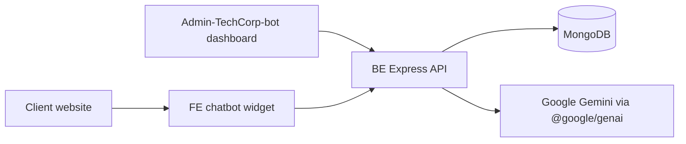
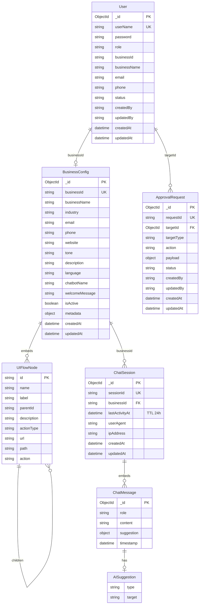

# AI Chatbot Integration Platform

Multi-tenant AI chatbot platform for businesses. The repository contains:

- `BE`: Node.js/Express backend with MongoDB, RBAC, approval workflow, chat sessions, and Gemini integration.
- `FE`: reusable React chatbot widget package (`@ai-chatbot-platform/react`).
- `Admin-TechCorp-bot`: React admin/business dashboard for account approval and chatbot configuration.
- `docs`: generated architecture documentation, including the class diagram.

This README describes the current source code, not the older draft architecture.

## Documentation

- Class diagram source: `docs/class-diagram.md`
- Rendered class diagram: `docs/class-diagram.svg`
- Editable draw.io diagram: `docs/class-diagram.drawio`

## Repository Structure

```text
AI-Platform-For-Business/
|-- BE/
|   |-- scripts/
|   |   `-- seed.js
|   |-- src/
|   |   |-- config/
|   |   |   |-- ai.js
|   |   |   `-- database.js
|   |   |-- controllers/
|   |   |   |-- adminController.js
|   |   |   |-- authController.js
|   |   |   |-- chatController.js
|   |   |   |-- configController.js
|   |   |   `-- userManagementController.js
|   |   |-- middlewares/
|   |   |   |-- adminAuth.js
|   |   |   |-- auth.js
|   |   |   |-- errorHandler.js
|   |   |   `-- validator.js
|   |   |-- models/
|   |   |   |-- ApprovalRequest.js
|   |   |   |-- BusinessConfig.js
|   |   |   |-- ChatSession.js
|   |   |   `-- User.js
|   |   |-- routes/
|   |   |   |-- adminRoutes.js
|   |   |   |-- authRoutes.js
|   |   |   |-- businessRoutes.js
|   |   |   |-- chatRoutes.js
|   |   |   |-- configRoutes.js
|   |   |   |-- index.js
|   |   |   `-- userManagementRoutes.js
|   |   |-- services/
|   |   |   |-- aiService.js
|   |   |   |-- businessConfigService.js
|   |   |   `-- chatSessionService.js
|   |   |-- app.js
|   |   `-- server.js
|   `-- package.json
|-- FE/
|   |-- src/
|   |   |-- api/chatbotClient.ts
|   |   |-- components/
|   |   |-- demo/
|   |   |-- hooks/
|   |   |-- store/chatStore.ts
|   |   |-- styles/chatbot.css
|   |   |-- types/index.ts
|   |   `-- index.ts
|   `-- package.json
|-- Admin-TechCorp-bot/
|   |-- src/
|   |   |-- api/
|   |   |-- components/
|   |   |-- i18n/
|   |   |-- layouts/
|   |   |-- pages/
|   |   `-- router/
|   `-- package.json
|-- docs/
|   |-- class-diagram.drawio
|   |-- class-diagram.md
|   `-- class-diagram.svg
`-- README.md
```

## System Overview



Main runtime flow:

1. A client site renders `Chatbot` from the `FE` package.
2. The widget loads public config from `GET /api/config/:businessId`.
3. A visitor sends a message to `POST /api/chat/:businessId`.
4. The backend loads `BusinessConfig`, reads recent `ChatSession.messages`, builds a Gemini system prompt, and requests an AI response.
5. The backend stores user and assistant messages in `ChatSession`.
6. The widget renders the assistant message and optional navigation/action suggestion.

## Tech Stack

### Backend (`BE`)

| Technology | Purpose |
|---|---|
| Node.js >= 18 | Runtime |
| Express | HTTP API |
| Mongoose | MongoDB ODM |
| MongoDB / mongodb-memory-server | Persistent DB or local dev fallback |
| @google/genai | Gemini integration used by `aiService.js` |
| Joi | Request validation |
| jsonwebtoken | JWT auth for dashboard/business APIs |
| bcryptjs | Password hashing |
| helmet, cors, express-rate-limit | API hardening |
| winston, morgan | Logging |

### Chatbot Widget (`FE`)

| Technology | Purpose |
|---|---|
| React 18+ peer dependency | Widget UI |
| TypeScript | Public package types |
| Vite | Dev server and library build |
| Zustand | Chat state store |
| Ant Design | Float button dependency |
| vite-plugin-dts | Type declaration build |

### Admin Dashboard (`Admin-TechCorp-bot`)

| Technology | Purpose |
|---|---|
| React 19 | Dashboard UI |
| TypeScript | Application types |
| Vite 7 | Dev/build tooling |
| Ant Design | Admin forms, tables, modals |
| Axios | Backend API client |
| i18next/react-i18next | Localization |
| jwt-decode | Token inspection |

## Data Model

The backend uses Mongoose models in `BE/src/models`.



### Enum Values

| Field | Values |
|---|---|
| `User.role` | `ADMIN_SYSTEM`, `ADMIN`, `BUSINESS` |
| `User.status` | `Active`, `Inactive` |
| `BusinessConfig.tone` | `professional`, `friendly`, `casual`, `formal`, `neutral` |
| `BusinessConfig.language` | `auto`, `en`, `vi`, `fr`, `es`, `de`, `ja`, `zh` |
| `UIFlowNode.actionType` | `navigate`, `action`, `info` |
| `ChatMessage.role` | `user`, `assistant` |
| `AISuggestion.type` | `navigate`, `action` |
| `ApprovalRequest.targetType` | `ADMIN`, `BUSINESS` |
| `ApprovalRequest.action` | `CREATE`, `UPDATE`, `DELETE` |
| `ApprovalRequest.status` | `Pending`, `Approved`, `Rejected` |

## Quick Start

### Prerequisites

- Node.js >= 18
- npm
- A Gemini API key
- MongoDB is optional in local development. If a local MongoDB connection is not available, the backend attempts to use `mongodb-memory-server`.

### Backend

```bash
cd BE
npm install
cp .env.example .env
npm run dev
```

On Windows PowerShell, use:

```powershell
cd BE
npm install
Copy-Item .env.example .env
npm run dev
```

Set at least `GEMINI_API_KEY` in `BE/.env`. Use `MONGO_URI` for persistent storage.

Backend URL:

```text
http://localhost:5000/api
```

Health check:

```http
GET http://localhost:5000/api/health
```

Seed demo business config:

```bash
cd BE
node scripts/seed.js
```

### Admin Dashboard

```bash
cd Admin-TechCorp-bot
npm install
npm run dev
```

Admin dashboard URL:

```text
http://localhost:4000
```

The dashboard API base URL is currently hard-coded in `Admin-TechCorp-bot/src/api/client.ts`:

```ts
baseURL: 'http://localhost:5000/api'
```

### Chatbot Widget Demo

```bash
cd FE
npm install
cp .env.example .env
npm run dev
```

On Windows PowerShell:

```powershell
cd FE
npm install
Copy-Item .env.example .env
npm run dev
```

Widget demo URL is the Vite default, usually:

```text
http://localhost:5173
```

Build the reusable package:

```bash
cd FE
npm run build
```

## Environment Variables

### `BE/.env`

| Variable | Required | Current default in code | Description |
|---|---:|---|---|
| `PORT` | No | `5000` | Backend port |
| `NODE_ENV` | No | `development` | Runtime environment |
| `GEMINI_API_KEY` | Yes | none | Gemini API key |
| `GEMINI_MODEL` | No | `gemini-2.5-flash` | Gemini model used by `aiService` |
| `MONGO_URI` | Production yes | local MongoDB URI | MongoDB connection string |
| `JWT_SECRET` | Production yes | `secret-key-123` | JWT signing secret |
| `ADMIN_API_KEY` | Yes for `/api/admin/*` | none | API key for admin config routes |
| `CORS_ORIGINS` | No | `http://localhost:3000` | Comma-separated allowed origins |
| `RATE_LIMIT_WINDOW_MS` | No | `60000` | API rate limit window |
| `RATE_LIMIT_MAX` | No | `60` | Max requests per window |
| `LOG_LEVEL` | No | `info` | Winston log level |

### `FE/.env`

| Variable | Required | Example | Description |
|---|---:|---|---|
| `VITE_API_URL` | Yes | `http://localhost:5000/api` | Backend API base URL |
| `VITE_BUSINESS_ID` | Yes | `demo-business` | Business config loaded by the demo |

## API Reference

### Public Chatbot APIs

#### Health

```http
GET /api/health
```

#### Load public chatbot config

```http
GET /api/config/:businessId
```

Response shape:

```json
{
  "success": true,
  "data": {
    "businessId": "demo-business",
    "businessName": "TechCorp Solutions",
    "industry": "Enterprise Software",
    "website": "https://example.com",
    "tone": "professional",
    "chatbotName": "TechBot",
    "welcomeMessage": "Hi! How can I help you today?",
    "language": "auto",
    "uiFlowTree": []
  }
}
```

#### Send chat message

```http
POST /api/chat/:businessId
Content-Type: application/json

{
  "message": "What products do you offer?",
  "sessionId": "550e8400-e29b-41d4-a716-446655440000"
}
```

`sessionId` is optional. If omitted, the backend creates one.

Response shape:

```json
{
  "success": true,
  "data": {
    "sessionId": "550e8400-e29b-41d4-a716-446655440000",
    "message": "You can view our product catalog here.",
    "suggestion": {
      "type": "navigate",
      "target": "products",
      "label": "View products",
      "url": "/products"
    }
  }
}
```

#### Get chat history

```http
GET /api/chat/:businessId/history/:sessionId?limit=50
```

The current implementation returns `messages` from `ChatSession`, not a `history` field.

#### Clear chat session

```http
DELETE /api/chat/:businessId/session/:sessionId
```

### Auth APIs

```http
POST /api/auth/login
POST /api/auth/register-business
POST /api/auth/seed
GET  /api/auth/me
POST /api/auth/change-password
```

Routes requiring login use:

```http
Authorization: Bearer <jwt>
```

### Business JWT APIs

These routes are used by `Admin-TechCorp-bot` for business self-service configuration.

```http
GET   /api/business/my-config
GET   /api/business/config/:businessId
PATCH /api/business/config/:businessId/business-info
PATCH /api/business/config/:businessId/description
PATCH /api/business/config/:businessId/ui-flow
POST  /api/business/setup
PATCH /api/business/update-config/:businessId
```

`BUSINESS` users can only access their own `businessId`. `ADMIN` and `ADMIN_SYSTEM` can access broader business config routes.

### User Management JWT APIs

```http
GET  /api/users-management/dashboard?period=month
GET  /api/users-management/businesses
GET  /api/users-management/admins
PUT  /api/users-management/users/:targetId/request-update
POST /api/users-management/create-admin
GET  /api/users-management/requests
POST /api/users-management/requests/:requestId/handle
```

These routes require `ADMIN` or `ADMIN_SYSTEM` unless otherwise enforced by route logic.

### Admin API-Key APIs

Routes under `/api/admin/*` require:

```http
x-api-key: <ADMIN_API_KEY>
```

```http
POST   /api/admin/config
GET    /api/admin/config?page=1&limit=20
GET    /api/admin/config/:businessId
PATCH  /api/admin/config/:businessId/business-info
PATCH  /api/admin/config/:businessId/description
PATCH  /api/admin/config/:businessId/ui-flow
DELETE /api/admin/config/:businessId
```

Example full config upsert:

```json
{
  "businessId": "my-business",
  "businessName": "My Company",
  "industry": "Retail",
  "email": "support@example.com",
  "phone": "+84 123 456 789",
  "website": "https://example.com",
  "tone": "professional",
  "description": "A business description used as the chatbot knowledge base.",
  "uiFlowTree": [],
  "chatbotName": "SupportBot",
  "welcomeMessage": "Hello! How can I help you today?",
  "language": "auto"
}
```

## Admin and Business Workflow

### Roles

| Role | Main permissions |
|---|---|
| `ADMIN_SYSTEM` | Highest privilege. Can approve `ADMIN` creation and manage system-level data. |
| `ADMIN` | Can view businesses/admins, request user updates, approve `BUSINESS` requests. |
| `BUSINESS` | Manages its own business config, description, UI flow, and chatbot settings. |

### Business registration

1. A business registers via `POST /api/auth/register-business`.
2. Backend creates an inactive `User` with role `BUSINESS`.
3. Backend creates an `ApprovalRequest` with action `CREATE`.
4. `ADMIN` or `ADMIN_SYSTEM` reviews the request from the dashboard.
5. On approval, the business account status becomes `Active`.

### First-time business setup

1. A `BUSINESS` user logs in.
2. If no config exists, the dashboard sends the user to the setup wizard.
3. `POST /api/business/setup` creates `BusinessConfig`.
4. The route also binds `businessId` to the `User` and returns a fresh JWT containing the confirmed `businessId`.

### Maker-checker user update

1. `ADMIN` or `ADMIN_SYSTEM` submits an update request for a user.
2. Backend creates an `ApprovalRequest` with action `UPDATE`.
3. A permitted reviewer approves or rejects the request.
4. On approval, the payload is merged into the target `User`.

## UI Flow Tree Schema

Current v2 schema supports both new fields and older compatibility fields.

```ts
export interface UIFlowNode {
  id: string;
  name?: string;
  label?: string;
  parentId?: string | null;
  description?: string;
  actionType?: 'navigate' | 'action' | 'info';
  url?: string;
  path?: string;
  action?: string;
  children?: UIFlowNode[];
}
```

Example:

```json
[
  {
    "id": "home",
    "name": "Home",
    "actionType": "navigate",
    "url": "/",
    "children": [
      {
        "id": "products",
        "name": "Products",
        "parentId": "home",
        "description": "Product catalog",
        "actionType": "navigate",
        "url": "/products",
        "children": []
      },
      {
        "id": "contact",
        "name": "Contact sales",
        "parentId": "home",
        "description": "Open contact form",
        "actionType": "action",
        "url": "/contact",
        "action": "open_contact_form",
        "children": []
      }
    ]
  }
]
```

## Chatbot Widget Usage

Package entry point:

```ts
import { Chatbot } from '@ai-chatbot-platform/react';
import '@ai-chatbot-platform/react/dist/style.css';
```

Example:

```tsx
<Chatbot
  apiUrl="http://localhost:5000/api"
  businessId="demo-business"
  mode="float"
  primaryColor="#6366f1"
  defaultOpen={false}
  onNavigate={(nodeId, label) => {
    console.log('navigate', nodeId, label);
  }}
  onAction={(nodeId, label) => {
    console.log('action', nodeId, label);
  }}
/>
```

Props:

| Prop | Type | Default |
|---|---|---|
| `apiUrl` | `string` | required |
| `businessId` | `string` | required |
| `mode` | `'float' \| 'fullpage'` | `'float'` |
| `chatbotName` | `string` | remote config |
| `welcomeMessage` | `string` | remote config |
| `primaryColor` | `string` | `'#6366f1'` |
| `defaultOpen` | `boolean` | `false` |
| `onNavigate` | `(nodeId: string, label?: string) => void` | none |
| `onAction` | `(nodeId: string, label?: string) => void` | none |
| `className` | `string` | `''` |

Exported hooks and store:

```ts
import {
  useChatbot,
  useBusinessConfig,
  useChatStore,
} from '@ai-chatbot-platform/react';
```

## AI Behavior

`AIService` builds a system prompt from:

- `BusinessConfig.businessName`
- `BusinessConfig.industry`
- `BusinessConfig.description`
- `BusinessConfig.website`
- `BusinessConfig.tone`
- `BusinessConfig.language`
- `BusinessConfig.uiFlowTree`
- `BusinessConfig.chatbotName`

Gemini is instructed to return JSON only.

Possible response with navigation:

```json
{
  "message": "You can view this feature here.",
  "suggestion": {
    "type": "navigate",
    "target": "products",
    "label": "View products",
    "url": "/products"
  }
}
```

Possible response with action:

```json
{
  "message": "I can open the contact form for you.",
  "suggestion": {
    "type": "action",
    "target": "contact",
    "label": "Contact sales"
  }
}
```

Possible response without suggestion:

```json
{
  "message": "I do not have that information in the configured business context."
}
```

## Current Implementation Notes

- `ChatSession` persists `messages`; older docs that mention `history` are outdated.
- The API response suggestion may include `label` and `url`. The current `ChatSession` model stores the suggestion object primarily as `type` and `target`.
- `BusinessConfig` model contains `email` and `phone`. Some older backend code and seed data still reference `contact`; prefer `email`, `phone`, and `website` for new work.
- Backend `BusinessConfig.tone` accepts `professional`, `friendly`, `casual`, `formal`, and `neutral`. The admin UI currently also shows `humorous`, which the backend will reject unless the backend enum is expanded.
- `/business/*` routes are implemented directly in `BE/src/routes/businessRoutes.js`, not through a separate controller module.
- There is no `LICENSE` file in the repository at the moment, so this README does not claim a license.

## Useful Commands

```bash
# Backend
cd BE
npm run dev
npm run lint

# Chatbot widget
cd FE
npm run dev
npm run build
npm run type-check

# Admin dashboard
cd Admin-TechCorp-bot
npm run dev
npm run build
npm run lint
```
