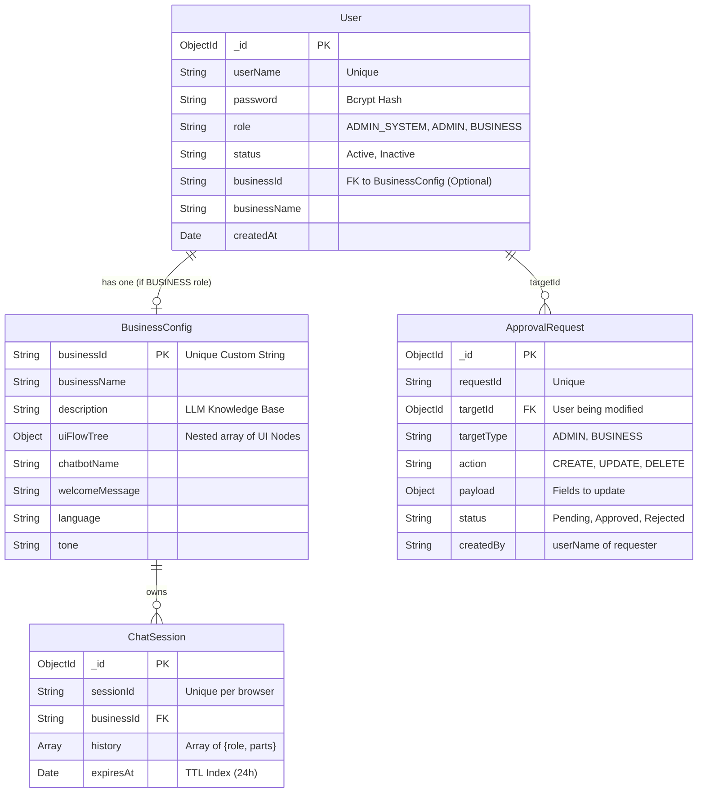

# 🤖 AI Chatbot Integration Platform

> **Enterprise-grade, multi-tenant AI chatbot platform** — plug any business's chatbot into any website in minutes, powered by Google Gemini AI.

[](https://nodejs.org)
[](https://reactjs.org)
[](https://typescriptlang.org)
[](https://ai.google.dev)
[](https://mongodb.com)
[](LICENSE)

---

## 📋 Table of Contents

- [Project Overview](#-project-overview)
- [System Architecture](#-system-architecture)
- [Folder Structure](#-folder-structure)
- [Tech Stack](#-tech-stack)
- [Quick Start](#-quick-start)
  - [Prerequisites](#prerequisites)
  - [Backend Setup (BE)](#backend-setup-be)
  - [Frontend Setup (FE)](#frontend-setup-fe)
- [Environment Variables](#-environment-variables)
- [API Reference](#-api-reference)
  - [Public APIs](#public-apis)
  - [Admin APIs](#admin-apis)
- [AI Behavior](#-ai-behavior)
- [Frontend Library Usage](#-frontend-library-usage)
- [Data Flow](#-data-flow)
- [Admin Configuration Guide](#-admin-configuration-guide)
- [UI Flow Tree Schema](#-ui-flow-tree-schema)
- [Future Improvements](#-future-improvements)

---

## 🎯 Project Overview

The **AI Chatbot Integration Platform** is a **reusable, multi-tenant SaaS system** that allows any business to embed an intelligent AI chatbot into their website without building one from scratch.

### Key Capabilities

| Feature | Description |
|---|---|
| 🏢 **Multi-tenant & RBAC** | Isolated config per business. Role-based access control (ADMIN_SYSTEM, ADMIN, BUSINESS) |
| 🛡️ **Approval Workflows** | Built-in Maker-Checker system for user creation and configuration updates |
| 🧠 **Context-aware AI** | Gemini AI answers only based on your business description — no hallucination |
| 🗺️ **UI Navigation** | AI suggests specific pages/actions based on the website's structure |
| 📦 **NPM Library** | Frontend ships as a publishable React library for easy integration |
| 🔧 **Admin API & Dashboard** | Full REST API and React UI to manage businesses and system users |
| 💬 **Session Memory** | Conversations persist per-session with 24h auto-expiry |
| 🎨 **Fully Customizable** | Brand colors, chatbot name, welcome message, display mode |

---

## 🗄️ Database Schema

The platform uses MongoDB with Mongoose ODMs. Below is the Entity-Relationship mapping for the core collections:



---

## 🏗️ System Architecture

```
┌─────────────────────────────────────────────────────────────┐
│                    CLIENT WEBSITES                           │
│   ┌──────────────────────────────────────────────────────┐  │
│   │  <Chatbot apiUrl="..." businessId="..." mode="float"/> │  │
│   └──────────────────────────────────────────────────────┘  │
└────────────────────────┬────────────────────────────────────┘
                         │ HTTP REST
┌────────────────────────▼────────────────────────────────────┐
│              BACKEND (Node.js + Express)                     │
│                                                              │
│  ┌──────────┐  ┌────────────┐  ┌───────────┐  ┌─────────┐  │
│  │  Routes  │→ │Controllers │→ │  Services │→ │ Models  │  │
│  └──────────┘  └────────────┘  └─────┬─────┘  └────┬────┘  │
│                                       │              │       │
│                              ┌────────▼──────┐  ┌───▼────┐  │
│                              │  AI Service   │  │MongoDB │  │
│                              │ (Gemini API)  │  └────────┘  │
│                              └───────────────┘              │
└─────────────────────────────────────────────────────────────┘
```

### Core Flow

```
User types message
      ↓
FE sends POST /api/chat/:businessId  { message, sessionId }
      ↓
BE loads BusinessConfig from MongoDB
      ↓
BE builds system prompt (business desc + UI flow tree)
      ↓
BE calls Google Gemini with conversation history
      ↓
Gemini returns structured JSON { message, suggestion? }
      ↓
BE saves exchange to ChatSession (MongoDB)
      ↓
FE receives response → renders message + suggestion chip
      ↓
User clicks suggestion → onNavigate(nodeId) callback fires
```

---

## 📁 Folder Structure

```
AI-Platform-For-Business/
├── BE/                              # Backend (Node.js + Express)
│   ├── scripts/
│   │   └── seed.js                 # Database seed script
│   ├── src/
│   │   ├── config/
│   │   │   ├── ai.js               # Gemini AI configuration
│   │   │   └── database.js         # MongoDB connection
│   │   ├── controllers/
│   │   │   ├── adminController.js  # Admin CRUD operations
│   │   │   ├── chatController.js   # Chat message handling
│   │   │   └── configController.js # Public config endpoint
│   │   ├── middlewares/
│   │   │   ├── adminAuth.js        # API key authentication
│   │   │   ├── errorHandler.js     # Global error handler
│   │   │   └── validator.js        # Joi request validation
│   │   ├── models/
│   │   │   ├── User.js             # RBAC Users (Admin/Business)
│   │   │   ├── BusinessConfig.js   # Business config schema
│   │   │   ├── ChatSession.js      # Chat session schema (TTL)
│   │   │   └── ApprovalRequest.js  # Maker-checker workflow
│   │   ├── routes/
│   │   │   ├── index.js            # Route aggregator
│   │   │   ├── authRoutes.js       # Login / Register
│   │   │   ├── userManagementRoutes.js # Approvals & Admin CRUD
│   │   │   ├── businessRoutes.js   # Self-serve business config
│   │   │   ├── adminRoutes.js      # System-wide config management
│   │   │   ├── chatRoutes.js       # /api/chat/*
│   │   │   └── configRoutes.js     # Public config endpoint
│   │   ├── services/
│   │   │   ├── aiService.js        # Google Gemini integration ⭐
│   │   │   ├── businessConfigService.js
│   │   │   └── chatSessionService.js
│   │   ├── utils/
│   │   │   ├── helpers.js
│   │   │   └── logger.js           # Winston logger
│   │   ├── app.js                  # Express app setup
│   │   └── server.js              # Entry point
│   ├── .env.example
│   ├── .gitignore
│   └── package.json
│
├── FE/                              # Frontend Library (React + TS)
│   ├── src/
│   │   ├── api/
│   │   │   └── chatbotClient.ts    # Type-safe API client
│   │   ├── components/
│   │   │   ├── ChatBox/
│   │   │   │   ├── ChatBox.tsx     # Main chat panel ⭐
│   │   │   │   ├── ChatHeader.tsx
│   │   │   │   ├── ChatInput.tsx
│   │   │   │   ├── ChatMessage.tsx
│   │   │   │   ├── MessageList.tsx
│   │   │   │   └── TypingIndicator.tsx
│   │   │   ├── Chatbot/
│   │   │   │   └── Chatbot.tsx     # Root export component ⭐
│   │   │   └── FloatChatButton/
│   │   │       └── FloatChatButton.tsx
│   │   ├── demo/
│   │   │   ├── DemoApp.tsx         # Interactive demo
│   │   │   └── main.tsx
│   │   ├── hooks/
│   │   │   ├── useChatbot.ts       # Main chat hook ⭐
│   │   │   └── useBusinessConfig.ts
│   │   ├── store/
│   │   │   └── chatStore.ts        # Zustand state store
│   │   ├── styles/
│   │   │   └── chatbot.css         # All component styles
│   │   ├── types/
│   │   │   └── index.ts            # TypeScript types
│   │   └── index.ts                # Library entry point
│   ├── .env.example
│   ├── .gitignore
│   ├── index.html
│   ├── package.json
│   ├── tsconfig.json
│   └── vite.config.ts
│
└── README.md
```

---

## ⚙️ Tech Stack

### Backend
| Technology | Purpose |
|---|---|
| **Node.js 18+** | Runtime |
| **Express.js** | HTTP framework |
| **@google/generative-ai** | Gemini AI SDK |
| **Mongoose** | MongoDB ODM |
| **Joi** | Request validation |
| **Helmet** | Security headers |
| **express-rate-limit** | Rate limiting |
| **Winston** | Structured logging |
| **dotenv** | Environment config |

### Frontend
| Technology | Purpose |
|---|---|
| **React 18** | UI library |
| **TypeScript 5** | Type safety |
| **Vite** | Build tool + dev server |
| **Zustand** | Lightweight state management |
| **Ant Design (antd)** | FloatButton component |
| **vite-plugin-dts** | TypeScript declarations for library |

---

## 🚀 Quick Start

### Prerequisites

- Node.js >= 18.0.0
- MongoDB running locally or a MongoDB Atlas URI
- Google Gemini API key ([Get one free](https://ai.google.dev))

---

### Backend Setup (BE)

```bash
# 1. Navigate to backend
cd BE

# 2. Install dependencies
npm install

# 3. Configure environment
cp .env.example .env
# Edit .env and fill in GEMINI_API_KEY, MONGO_URI, ADMIN_API_KEY

# 4. Seed demo data (optional)
node scripts/seed.js

# 5. Start dev server
npm run dev
# Server starts at http://localhost:5000
```

---

### Frontend Setup (FE)

```bash
# 1. Navigate to frontend
cd FE

# 2. Install dependencies
npm install

# 3. Configure environment
cp .env.example .env
# Set VITE_API_URL and VITE_BUSINESS_ID

# 4. Run demo app
npm run dev
# Opens at http://localhost:5173

# 5. Build library for publishing
npm run build
# Outputs to FE/dist/
```

---

## 🔐 Environment Variables

### Backend (`BE/.env`)

| Variable | Required | Default | Description |
|---|---|---|---|
| `PORT` | No | `5000` | Server port |
| `NODE_ENV` | No | `development` | Environment |
| `GEMINI_API_KEY` | **Yes** | — | Google Gemini API key |
| `GEMINI_MODEL` | No | `gemini-1.5-flash` | Gemini model name |
| `MONGO_URI` | **Yes** | — | MongoDB connection string |
| `ADMIN_API_KEY` | **Yes** | — | Secret key for admin APIs |
| `CORS_ORIGINS` | No | `http://localhost:3000` | Comma-separated allowed origins |
| `RATE_LIMIT_WINDOW_MS` | No | `60000` | Rate limit window (ms) |
| `RATE_LIMIT_MAX` | No | `60` | Max requests per window |
| `LOG_LEVEL` | No | `info` | Winston log level |

### Frontend (`FE/.env`)

| Variable | Required | Default | Description |
|---|---|---|---|
| `VITE_API_URL` | **Yes** | — | Backend API base URL |
| `VITE_BUSINESS_ID` | **Yes** | — | Business ID for demo |

---

## 📡 API Reference

### Public APIs

#### Send Chat Message
```http
POST /api/chat/:businessId
Content-Type: application/json

{
  "message": "What products do you offer?",
  "sessionId": "optional-uuid-to-continue-session"
}
```

**Response:**
```json
{
  "success": true,
  "data": {
    "sessionId": "550e8400-e29b-41d4-a716-446655440000",
    "message": "We offer TechCorp ERP, CRM, and Analytics. Would you like to see our products page?",
    "suggestion": {
      "type": "navigate",
      "target": "products"
    }
  }
}
```

#### Get Chat History
```http
GET /api/chat/:businessId/history/:sessionId?limit=50
```

#### Load Public Chatbot Config
```http
GET /api/config/:businessId
```

**Response:**
```json
{
  "success": true,
  "data": {
    "businessId": "demo-business",
    "businessName": "TechCorp Solutions",
    "chatbotName": "TechBot",
    "welcomeMessage": "Hi! How can I help you today?",
    "language": "auto",
    "uiFlowTree": [...]
  }
}
```

#### Health Check
```http
GET /api/health
```

---

### Admin APIs

> All admin routes require header: `x-api-key: <ADMIN_API_KEY>`

#### Create / Update Business Config
```http
POST /api/admin/config
x-api-key: your-admin-key
Content-Type: application/json

{
  "businessId": "my-business",
  "businessName": "My Company",
  "description": "We are a company that...",
  "uiFlowTree": [...],
  "chatbotName": "Assistant",
  "welcomeMessage": "Hello!",
  "language": "auto"
}
```

#### List All Configs
```http
GET /api/admin/config?page=1&limit=20
x-api-key: your-admin-key
```

#### Get Single Config
```http
GET /api/admin/config/:businessId
x-api-key: your-admin-key
```

#### Update Description Only
```http
PATCH /api/admin/config/:businessId/description
x-api-key: your-admin-key

{ "description": "Updated description..." }
```

#### Update UI Flow Tree Only
```http
PATCH /api/admin/config/:businessId/ui-flow
x-api-key: your-admin-key

{ "uiFlowTree": [...] }
```

#### Delete (Soft) Config
```http
DELETE /api/admin/config/:businessId
x-api-key: your-admin-key
```

---

## 🤖 AI Behavior

The AI (Google Gemini) is given a **structured system prompt** containing:

1. **Business Description** — all factual knowledge about the company
2. **UI Flow Tree** — full navigation structure with node IDs, paths, and actions

### Response Format

The AI is strictly instructed to return **valid JSON only**:

**With navigation suggestion:**
```json
{
  "message": "Sure! Let me take you to our pricing page.",
  "suggestion": {
    "type": "navigate",
    "target": "pricing"
  }
}
```

**With action suggestion:**
```json
{
  "message": "I can open the contact form for you right now!",
  "suggestion": {
    "type": "action",
    "target": "open_contact_form"
  }
}
```

**Without suggestion:**
```json
{
  "message": "Our ERP solution supports up to 10,000 concurrent users."
}
```

### Anti-hallucination
The system prompt explicitly instructs the AI:
- Only answer using provided business context
- If information is unknown, say so honestly
- Do not invent URLs, prices, or features

### Language Detection
When `language: "auto"` (default), the AI responds in the same language the user writes in (multilingual support out of the box).

---

## 📦 Frontend Library Usage

### Installation

```bash
npm install @ai-chatbot-platform/react antd
```

### Float Button Mode (recommended)

```tsx
import { Chatbot } from '@ai-chatbot-platform/react';
import '@ai-chatbot-platform/react/dist/style.css';

function App() {
  return (
    <div>
      {/* Your website content */}

      <Chatbot
        apiUrl="https://your-backend.com/api"
        businessId="your-business-id"
        mode="float"
        primaryColor="#6366f1"
        onNavigate={(nodeId) => {
          // Handle navigation — e.g., React Router
          router.push(`/${nodeId}`);
        }}
        onAction={(nodeId) => {
          // Handle actions — e.g., open modal
          if (nodeId === 'open_contact_form') setContactOpen(true);
        }}
      />
    </div>
  );
}
```

### Full Page Mode

```tsx
import { Chatbot } from '@ai-chatbot-platform/react';
import '@ai-chatbot-platform/react/dist/style.css';

function SupportPage() {
  return (
    <div style={{ height: '100vh' }}>
      <Chatbot
        apiUrl="https://your-backend.com/api"
        businessId="your-business-id"
        mode="fullpage"
        primaryColor="#0ea5e9"
        chatbotName="Support Bot"
        welcomeMessage="Hi! What can I help you with today?"
      />
    </div>
  );
}
```

### Props Reference

| Prop | Type | Default | Description |
|---|---|---|---|
| `apiUrl` | `string` | **required** | Backend API base URL |
| `businessId` | `string` | **required** | Business identifier |
| `mode` | `'float' \| 'fullpage'` | `'float'` | Display mode |
| `primaryColor` | `string` | `'#6366f1'` | Brand color (hex/rgb/hsl) |
| `chatbotName` | `string` | from config | Override chatbot display name |
| `welcomeMessage` | `string` | from config | Override welcome message |
| `defaultOpen` | `boolean` | `false` | Auto-open on mount (float mode) |
| `onNavigate` | `(nodeId: string) => void` | — | Called when suggestion is navigate |
| `onAction` | `(nodeId: string) => void` | — | Called when suggestion is action |
| `className` | `string` | `''` | Extra CSS class for root |

### Using Individual Hooks

```tsx
import { useChatbot, useChatStore } from '@ai-chatbot-platform/react';

// Inside a component
const { messages, sendMessage, isLoading } = useChatbot({
  apiUrl: 'http://localhost:5000/api',
  businessId: 'my-business',
  onNavigate: (nodeId) => console.log('Navigate to:', nodeId),
});
```

---

## 🔄 Data Flow

```
┌──────────┐         ┌──────────────────────────────┐
│   USER   │         │      REACT FRONTEND           │
│          │         │                               │
│  Types   │────────▶│  useChatbot hook              │
│ message  │         │    → addUserMessage()         │
└──────────┘         │    → setLoadingMessage()      │
                     │    → chatbotClient.sendMessage│
                     └────────────┬─────────────────┘
                                  │ POST /api/chat/:id
                     ┌────────────▼─────────────────┐
                     │       BACKEND (Express)       │
                     │                               │
                     │  chatController.sendMessage   │
                     │    → load BusinessConfig      │
                     │    → load session history     │
                     │    → aiService.generate()     │
                     └────────────┬─────────────────┘
                                  │ Gemini API call
                     ┌────────────▼─────────────────┐
                     │    GOOGLE GEMINI AI            │
                     │                               │
                     │  System prompt:               │
                     │    - Business description     │
                     │    - UI flow tree             │
                     │  Returns: JSON response       │
                     └────────────┬─────────────────┘
                                  │
                     ┌────────────▼─────────────────┐
                     │       BACKEND (Express)       │
                     │                               │
                     │  Parse & validate response    │
                     │  Save to ChatSession (DB)     │
                     │  Return to client             │
                     └────────────┬─────────────────┘
                                  │
                     ┌────────────▼─────────────────┐
                     │      REACT FRONTEND           │
                     │                               │
                     │  resolveLoadingMessage()      │
                     │  Show message + suggestion    │
                     │  User clicks suggestion       │
                     │    → onNavigate(nodeId)       │
                     └──────────────────────────────┘
```

---

## 🛠️ Admin Configuration Guide

### 1. Create a Business Config

```bash
curl -X POST http://localhost:5000/api/admin/config \
  -H "Content-Type: application/json" \
  -H "x-api-key: your-admin-key" \
  -d '{
    "businessId": "my-ecommerce-shop",
    "businessName": "Shopify Store Example",
    "description": "We sell premium handmade jewelry...",
    "chatbotName": "Jewel Assistant",
    "welcomeMessage": "Welcome! Looking for the perfect piece of jewelry?",
    "language": "auto",
    "uiFlowTree": [...]
  }'
```

### 2. Embed on Your Website

```tsx
<Chatbot
  apiUrl="http://localhost:5000/api"
  businessId="my-ecommerce-shop"
  mode="float"
/>
```

### 3. Update Description Anytime

```bash
curl -X PATCH http://localhost:5000/api/admin/config/my-ecommerce-shop/description \
  -H "x-api-key: your-admin-key" \
  -d '{ "description": "New updated description..." }'
```

---

## 🌳 UI Flow Tree Schema

```typescript
interface UIFlowNode {
  id: string;          // Unique identifier (returned in suggestions)
  label: string;       // Human-readable page/feature name
  description?: string; // What this page/feature does
  path?: string;       // URL path (e.g., "/products/erp")
  action?: string;     // Action identifier (e.g., "open_contact_form")
  children?: UIFlowNode[]; // Nested pages/features
}
```

**Example:**
```json
[
  {
    "id": "home",
    "label": "Home",
    "path": "/",
    "children": [
      {
        "id": "pricing",
        "label": "Pricing Plans",
        "description": "View subscription plans and pricing",
        "path": "/pricing",
        "children": []
      },
      {
        "id": "contact",
        "label": "Contact Sales",
        "description": "Open contact form",
        "action": "open_contact_form",
        "children": []
      }
    ]
  }
]
```

When a user asks "How much does it cost?", the AI will return:
```json
{
  "message": "Our plans start at $299/month. Would you like to see all pricing details?",
  "suggestion": { "type": "navigate", "target": "pricing" }
}
```

Your `onNavigate` callback receives `"pricing"` and you handle the routing.

---

## 🚀 Future Improvements

| Feature | Priority | Description |
|---|---|---|
| **WebSocket streaming** | High | Stream AI responses token-by-token |
| **File upload** | Medium | Allow users to share documents/screenshots |
| **Analytics dashboard** | Medium | Chat volume, common questions, satisfaction ratings |
| **A/B testing** | Medium | Test different prompts/personalities |
| **Voice input** | Low | Web Speech API integration |
| **Webhook events** | High | Notify external systems on chat events |
| **Multi-LLM support** | High | Support OpenAI, Anthropic, local models |
| **RAG integration** | High | Semantic search over business docs |
| **Auth per business** | Medium | JWT-based business tenant auth |
| **CDN script embed** | Medium | Vanilla JS `<script>` tag integration |
| **Conversation export** | Low | Export chat history as PDF/CSV |
| **Proactive messages** | Low | Bot initiates conversation after X seconds |

---

## 📄 License

MIT © AI Chatbot Platform Contributors

---

<div align="center">
  Built with ❤️ using <strong>Google Gemini AI</strong> · <strong>Node.js</strong> · <strong>React</strong>
</div>