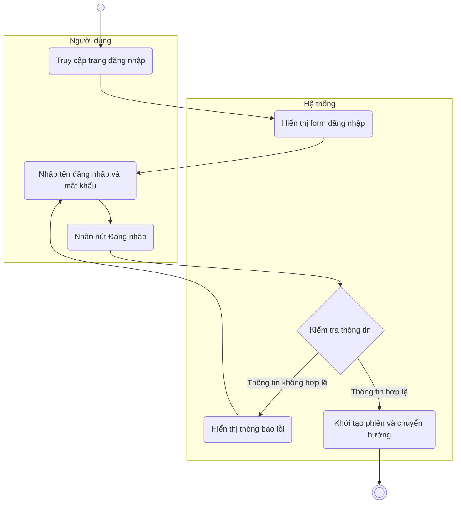

# Sơ đồ hoạt động - Đăng nhập

```mermaid
flowchart TD
  subgraph User [Người dùng]
    direction TB
    A(Truy cập trang đăng nhập)
    C(Nhập tên đăng nhập và mật khẩu)
    D(Nhấn nút Đăng nhập)
  end
  subgraph System [Hệ thống]
    direction TB
    B(Hiển thị form đăng nhập)
    E{Kiểm tra thông tin}
    F(Hiển thị thông báo lỗi)
    G(Khởi tạo phiên và chuyển hướng)
  end
  
  start(( )) --> A
  A --> B
  B --> C
  C --> D
  D --> E
  E -- Thông tin không hợp lệ --> F
  F --> C
  E -- Thông tin hợp lệ --> G
  G --> stop((( )))
```
