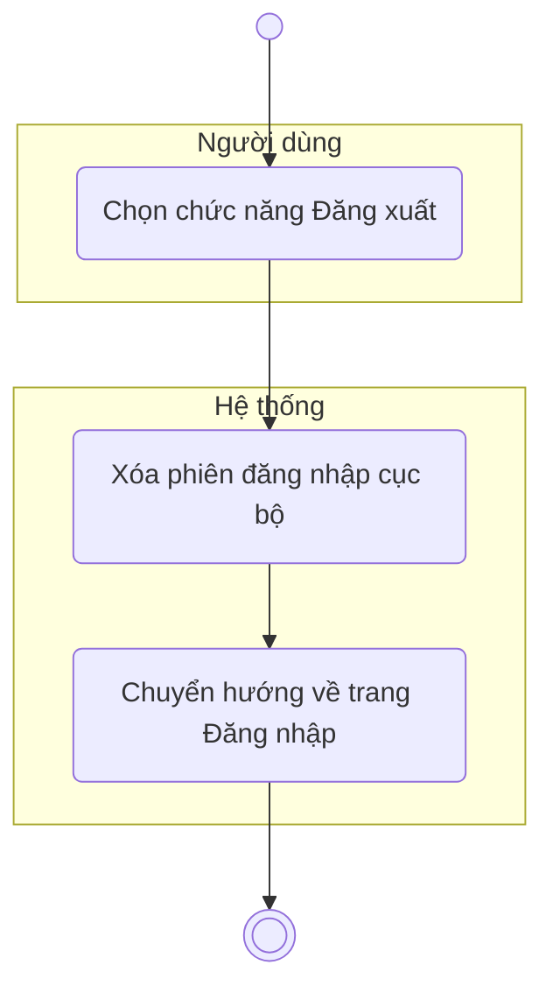

# Sơ đồ hoạt động - Đăng xuất

```mermaid
flowchart TD
  subgraph User [Người dùng]
    direction TB
    A(Chọn chức năng Đăng xuất)
  end
  subgraph System [Hệ thống]
    direction TB
    B(Xóa phiên đăng nhập cục bộ)
    C(Chuyển hướng về trang Đăng nhập)
  end
  
  start(( )) --> A
  A --> B
  B --> C
  C --> stop((( )))
```
