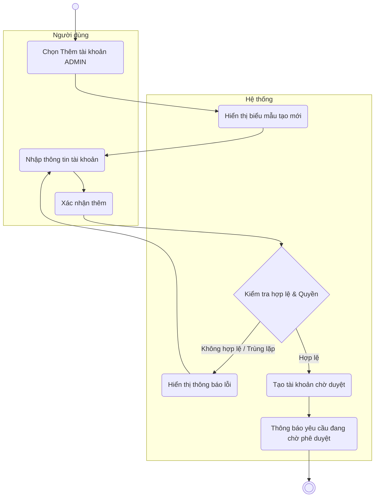

# Sơ đồ hoạt động - Tạo tài khoản ADMIN

```mermaid
flowchart TD
  subgraph User [Người dùng]
    direction TB
    A(Chọn Thêm tài khoản ADMIN)
    C(Nhập thông tin tài khoản)
    D(Xác nhận thêm)
  end
  subgraph System [Hệ thống]
    direction TB
    B(Hiển thị biểu mẫu tạo mới)
    E{Kiểm tra hợp lệ & Quyền}
    F(Hiển thị thông báo lỗi)
    G(Tạo tài khoản chờ duyệt)
    H(Thông báo yêu cầu đang chờ phê duyệt)
  end
  
  start(( )) --> A
  A --> B
  B --> C
  C --> D
  D --> E
  E -- Không hợp lệ / Trùng lặp --> F
  F --> C
  E -- Hợp lệ --> G
  G --> H
  H --> stop((( )))
```
