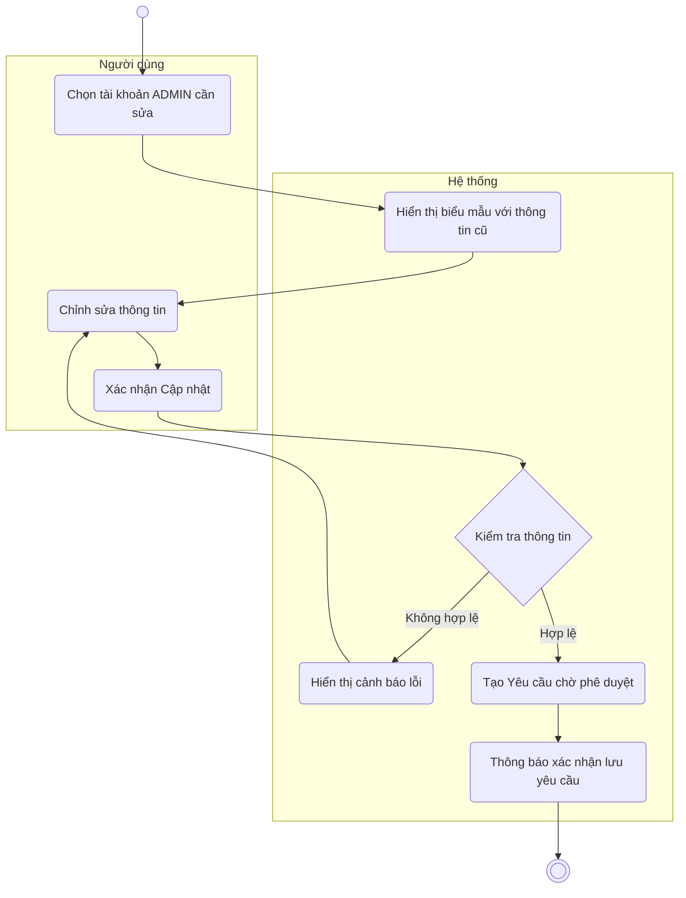

# Sơ đồ hoạt động - Cập nhật tài khoản ADMIN

```mermaid
flowchart TD
  subgraph User [Người dùng]
    direction TB
    A(Chọn tài khoản ADMIN cần sửa)
    C(Chỉnh sửa thông tin)
    D(Xác nhận Cập nhật)
  end
  subgraph System [Hệ thống]
    direction TB
    B(Hiển thị biểu mẫu với thông tin cũ)
    E{Kiểm tra thông tin}
    F(Hiển thị cảnh báo lỗi)
    G(Tạo Yêu cầu chờ phê duyệt)
    H(Thông báo xác nhận lưu yêu cầu)
  end
  
  start(( )) --> A
  A --> B
  B --> C
  C --> D
  D --> E
  E -- Không hợp lệ --> F
  F --> C
  E -- Hợp lệ --> G
  G --> H
  H --> stop((( )))
```
