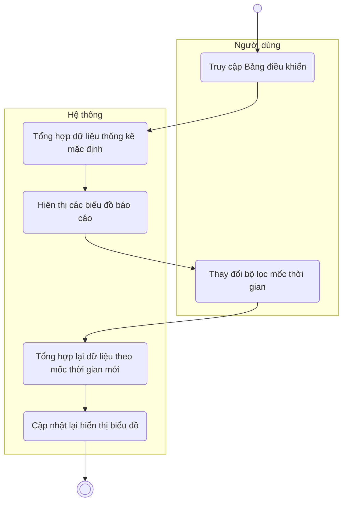

# Sơ đồ hoạt động - Quản lý xem báo cáo thống kê

```mermaid
flowchart TD
  subgraph User [Người dùng]
    direction TB
    A(Truy cập Bảng điều khiển)
    D(Thay đổi bộ lọc mốc thời gian)
  end
  subgraph System [Hệ thống]
    direction TB
    B(Tổng hợp dữ liệu thống kê mặc định)
    C(Hiển thị các biểu đồ báo cáo)
    E(Tổng hợp lại dữ liệu theo mốc thời gian mới)
    F(Cập nhật lại hiển thị biểu đồ)
  end
  
  start(( )) --> A
  A --> B
  B --> C
  C --> D
  D --> E
  E --> F
  F --> stop((( )))
```
