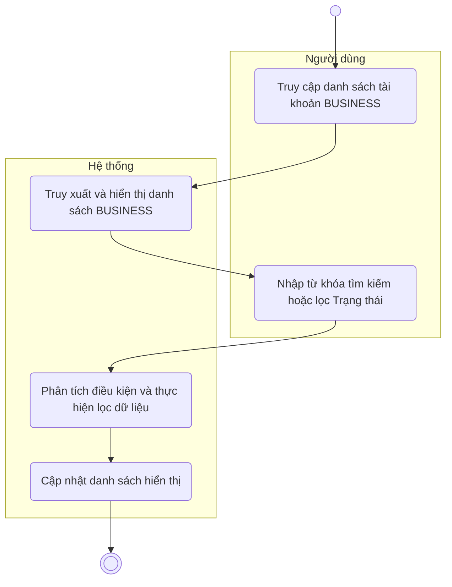

# Sơ đồ hoạt động - Tìm kiếm tài khoản BUSINESS

```mermaid
flowchart TD
  subgraph User [Người dùng]
    direction TB
    A(Truy cập danh sách tài khoản BUSINESS)
    C(Nhập từ khóa tìm kiếm hoặc lọc Trạng thái)
  end
  subgraph System [Hệ thống]
    direction TB
    B(Truy xuất và hiển thị danh sách BUSINESS)
    D(Phân tích điều kiện và thực hiện lọc dữ liệu)
    E(Cập nhật danh sách hiển thị)
  end
  
  start(( )) --> A
  A --> B
  B --> C
  C --> D
  D --> E
  E --> stop((( )))
```
