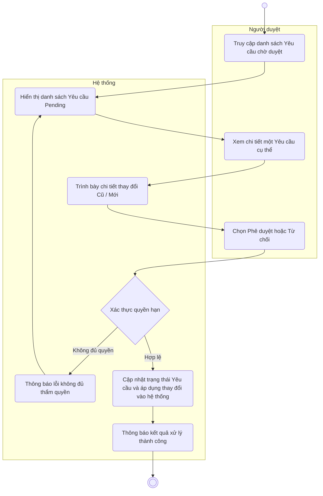

# Sơ đồ hoạt động - Phê duyệt yêu cầu

```mermaid
flowchart TD
  subgraph User [Người duyệt]
    direction TB
    A(Truy cập danh sách Yêu cầu chờ duyệt)
    C(Xem chi tiết một Yêu cầu cụ thể)
    E(Chọn Phê duyệt hoặc Từ chối)
  end
  subgraph System [Hệ thống]
    direction TB
    B(Hiển thị danh sách Yêu cầu Pending)
    D(Trình bày chi tiết thay đổi Cũ / Mới)
    F{Xác thực quyền hạn}
    G(Thông báo lỗi không đủ thẩm quyền)
    H(Cập nhật trạng thái Yêu cầu và áp dụng thay đổi vào hệ thống)
    I(Thông báo kết quả xử lý thành công)
  end
  
  start(( )) --> A
  A --> B
  B --> C
  C --> D
  D --> E
  E --> F
  F -- Không đủ quyền --> G
  G --> B
  F -- Hợp lệ --> H
  H --> I
  I --> stop((( )))
```
