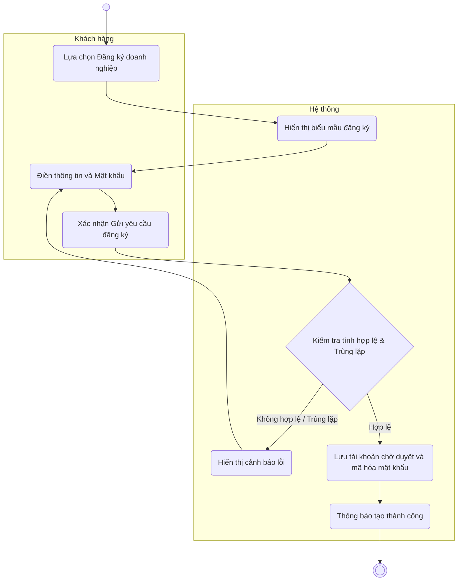

# Sơ đồ hoạt động - Đăng ký tài khoản BUSINESS

```mermaid
flowchart TD
  subgraph User [Khách hàng]
    direction TB
    A(Lựa chọn Đăng ký doanh nghiệp)
    C(Điền thông tin và Mật khẩu)
    D(Xác nhận Gửi yêu cầu đăng ký)
  end
  subgraph System [Hệ thống]
    direction TB
    B(Hiển thị biểu mẫu đăng ký)
    E{Kiểm tra tính hợp lệ & Trùng lặp}
    F(Hiển thị cảnh báo lỗi)
    G(Lưu tài khoản chờ duyệt và mã hóa mật khẩu)
    H(Thông báo tạo thành công)
  end
  
  start(( )) --> A
  A --> B
  B --> C
  C --> D
  D --> E
  E -- Không hợp lệ / Trùng lặp --> F
  F --> C
  E -- Hợp lệ --> G
  G --> H
  H --> stop((( )))
```
