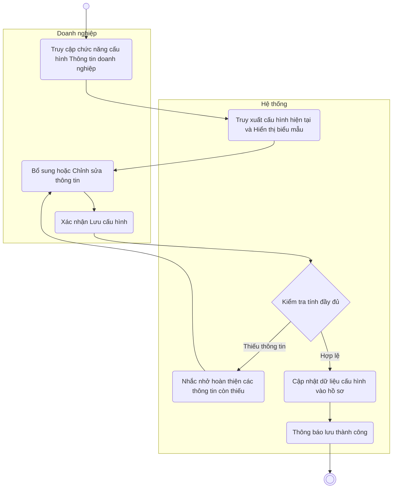

# Sơ đồ hoạt động - Cấu hình Chatbot (Thông tin doanh nghiệp)

```mermaid
flowchart TD
  subgraph User [Doanh nghiệp]
    direction TB
    A(Truy cập chức năng cấu hình Thông tin doanh nghiệp)
    C(Bổ sung hoặc Chỉnh sửa thông tin)
    D(Xác nhận Lưu cấu hình)
  end
  subgraph System [Hệ thống]
    direction TB
    B(Truy xuất cấu hình hiện tại và Hiển thị biểu mẫu)
    E{Kiểm tra tính đầy đủ}
    F(Nhắc nhở hoàn thiện các thông tin còn thiếu)
    G(Cập nhật dữ liệu cấu hình vào hồ sơ)
    H(Thông báo lưu thành công)
  end
  
  start(( )) --> A
  A --> B
  B --> C
  C --> D
  D --> E
  E -- Thiếu thông tin --> F
  F --> C
  E -- Hợp lệ --> G
  G --> H
  H --> stop((( )))
```
