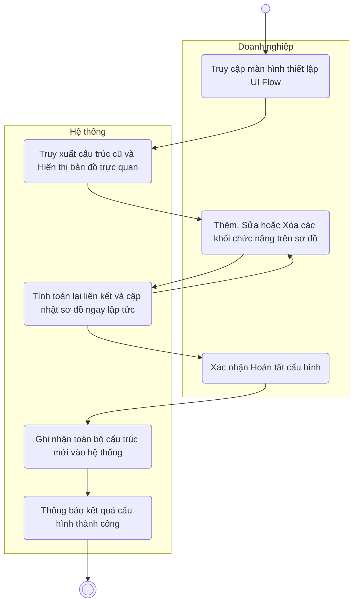

# Sơ đồ hoạt động - Cấu hình UI Flow

```mermaid
flowchart TD
  subgraph User [Doanh nghiệp]
    direction TB
    A(Truy cập màn hình thiết lập UI Flow)
    C(Thêm, Sửa hoặc Xóa các khối chức năng trên sơ đồ)
    E(Xác nhận Hoàn tất cấu hình)
  end
  subgraph System [Hệ thống]
    direction TB
    B(Truy xuất cấu trúc cũ và Hiển thị bản đồ trực quan)
    D(Tính toán lại liên kết và cập nhật sơ đồ ngay lập tức)
    F(Ghi nhận toàn bộ cấu trúc mới vào hệ thống)
    G(Thông báo kết quả cấu hình thành công)
  end
  
  start(( )) --> A
  A --> B
  B --> C
  C --> D
  D --> C
  D --> E
  E --> F
  F --> G
  G --> stop((( )))
```
