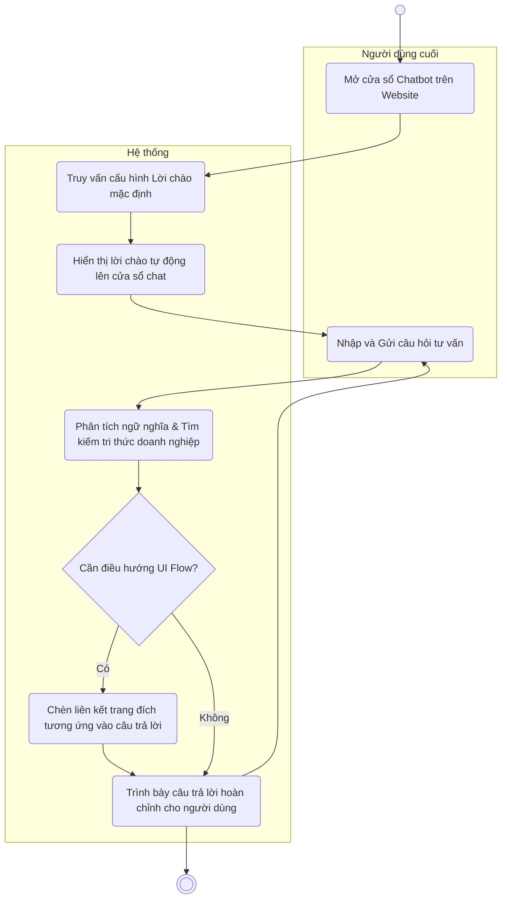

# Sơ đồ hoạt động - Tương tác Chatbot của WEBSITE USER

```mermaid
flowchart TD
  subgraph User [Người dùng cuối]
    direction TB
    A(Mở cửa sổ Chatbot trên Website)
    D(Nhập và Gửi câu hỏi tư vấn)
  end
  subgraph System [Hệ thống]
    direction TB
    B(Truy vấn cấu hình Lời chào mặc định)
    C(Hiển thị lời chào tự động lên cửa sổ chat)
    E(Phân tích ngữ nghĩa & Tìm kiếm tri thức doanh nghiệp)
    F{Cần điều hướng UI Flow?}
    G(Chèn liên kết trang đích tương ứng vào câu trả lời)
    H(Trình bày câu trả lời hoàn chỉnh cho người dùng)
  end
  
  start(( )) --> A
  A --> B
  B --> C
  C --> D
  D --> E
  E --> F
  F -- Có --> G
  G --> H
  F -- Không --> H
  H --> D
  H --> stop((( )))
```
