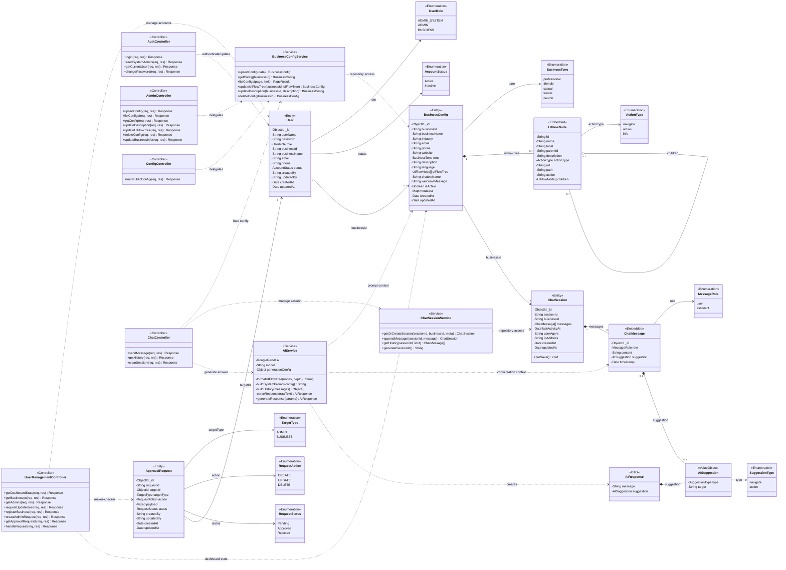

# Traditional UML Class Diagram - AI Chatbot Integration Platform

Scope: traditional enterprise-style UML class diagram for the backend domain and application layer.  
Source of truth: current code in `BE/src/models`, `BE/src/services`, and `BE/src/controllers`.

Artifacts:

- Mermaid source in this file
- Rendered SVG: `docs/class-diagram.svg`
- Editable draw.io source: `docs/class-diagram.drawio`

## Diagram

## Design Notes

- This is a UML class diagram, not a frontend component diagram.
- Mongoose models are represented as `<<Entity>>`.
- Nested schemas are represented as `<<Embedded>>`.
- `AISuggestion` and `AIResponse` are value/DTO-style classes used by chat flow.
- Services and controllers are included to show application-layer methods and dependencies.
- React hooks/components and API clients are intentionally excluded from this diagram because they belong in component/sequence diagrams, not the core UML class diagram.

## Verification Notes

- Entity fields were verified against `BE/src/models/User.js`, `BusinessConfig.js`, `ChatSession.js`, and `ApprovalRequest.js`.
- Service methods were verified against `BE/src/services/businessConfigService.js`, `chatSessionService.js`, and `aiService.js`.
- Controller methods were verified against `BE/src/controllers/authController.js`, `adminController.js`, `chatController.js`, `configController.js`, and `userManagementController.js`.
- `ChatSession` stores `messages`, not `history`.
- `BusinessConfig.tone` follows the backend enum: `professional`, `friendly`, `casual`, `formal`, `neutral`.
