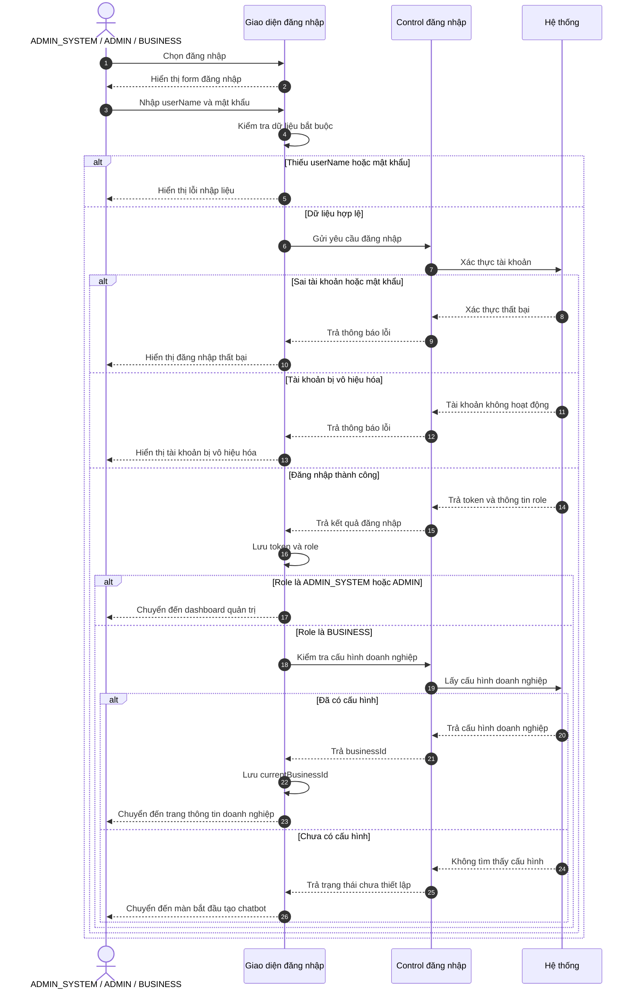

# Sơ đồ tuần tự - Đăng nhập

Actors tham gia: `ADMIN_SYSTEM`, `ADMIN`, `BUSINESS`.  
Actor không tham gia: `WEBSITE USER`.

```mermaid
sequenceDiagram
autonumber

actor SystemUser as ADMIN_SYSTEM / ADMIN / BUSINESS
participant LoginUI as Giao diện đăng nhập
participant LoginControl as Control đăng nhập
participant System as Hệ thống

SystemUser->>LoginUI: Chọn đăng nhập
LoginUI-->>SystemUser: Hiển thị form đăng nhập
SystemUser->>LoginUI: Nhập userName và mật khẩu
LoginUI->>LoginUI: Kiểm tra dữ liệu bắt buộc

alt Thiếu userName hoặc mật khẩu
  LoginUI-->>SystemUser: Hiển thị lỗi nhập liệu
else Dữ liệu hợp lệ
  LoginUI->>LoginControl: Gửi yêu cầu đăng nhập
  LoginControl->>System: Xác thực tài khoản

  alt Sai tài khoản hoặc mật khẩu
    System-->>LoginControl: Xác thực thất bại
    LoginControl-->>LoginUI: Trả thông báo lỗi
    LoginUI-->>SystemUser: Hiển thị đăng nhập thất bại
  else Tài khoản bị vô hiệu hóa
    System-->>LoginControl: Tài khoản không hoạt động
    LoginControl-->>LoginUI: Trả thông báo lỗi
    LoginUI-->>SystemUser: Hiển thị tài khoản bị vô hiệu hóa
  else Đăng nhập thành công
    System-->>LoginControl: Trả token và thông tin role
    LoginControl-->>LoginUI: Trả kết quả đăng nhập
    LoginUI->>LoginUI: Lưu token và role

    alt Role là ADMIN_SYSTEM hoặc ADMIN
      LoginUI-->>SystemUser: Chuyển đến dashboard quản trị
    else Role là BUSINESS
      LoginUI->>LoginControl: Kiểm tra cấu hình doanh nghiệp
      LoginControl->>System: Lấy cấu hình doanh nghiệp

      alt Đã có cấu hình
        System-->>LoginControl: Trả cấu hình doanh nghiệp
        LoginControl-->>LoginUI: Trả businessId
        LoginUI->>LoginUI: Lưu currentBusinessId
        LoginUI-->>SystemUser: Chuyển đến trang thông tin doanh nghiệp
      else Chưa có cấu hình
        System-->>LoginControl: Không tìm thấy cấu hình
        LoginControl-->>LoginUI: Trả trạng thái chưa thiết lập
        LoginUI-->>SystemUser: Chuyển đến màn bắt đầu tạo chatbot
      end
    end
  end
end
```
