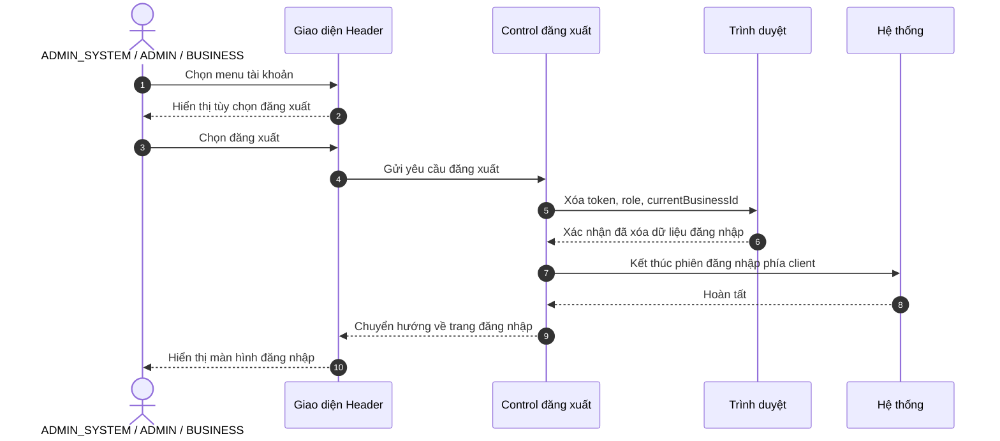

# Sơ đồ tuần tự - Đăng xuất

Actors tham gia: `ADMIN_SYSTEM`, `ADMIN`, `BUSINESS`.  
Actor không tham gia: `WEBSITE USER`.

```mermaid
sequenceDiagram
autonumber

actor SystemUser as ADMIN_SYSTEM / ADMIN / BUSINESS
participant HeaderUI as Giao diện Header
participant LogoutControl as Control đăng xuất
participant Browser as Trình duyệt
participant System as Hệ thống

SystemUser->>HeaderUI: Chọn menu tài khoản
HeaderUI-->>SystemUser: Hiển thị tùy chọn đăng xuất
SystemUser->>HeaderUI: Chọn đăng xuất
HeaderUI->>LogoutControl: Gửi yêu cầu đăng xuất
LogoutControl->>Browser: Xóa token, role, currentBusinessId
Browser-->>LogoutControl: Xác nhận đã xóa dữ liệu đăng nhập
LogoutControl->>System: Kết thúc phiên đăng nhập phía client
System-->>LogoutControl: Hoàn tất
LogoutControl-->>HeaderUI: Chuyển hướng về trang đăng nhập
HeaderUI-->>SystemUser: Hiển thị màn hình đăng nhập
```
