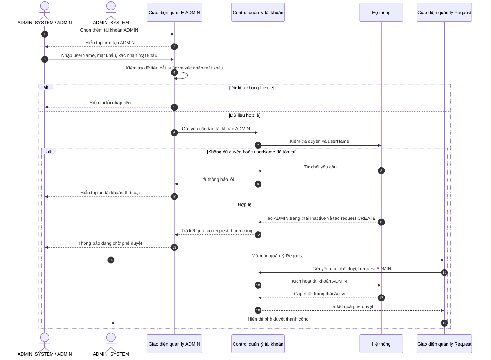

# Sơ đồ tuần tự - Thêm mới tài khoản ADMIN

Actors tham gia: `ADMIN_SYSTEM`, `ADMIN`.  
Actors không tham gia: `BUSINESS`, `WEBSITE USER`.

```mermaid
sequenceDiagram
autonumber

actor Requester as ADMIN_SYSTEM / ADMIN
actor AdminSystem as ADMIN_SYSTEM
participant AdminUI as Giao diện quản lý ADMIN
participant AdminControl as Control quản lý tài khoản
participant System as Hệ thống
participant RequestUI as Giao diện quản lý Request

Requester->>AdminUI: Chọn thêm tài khoản ADMIN
AdminUI-->>Requester: Hiển thị form tạo ADMIN
Requester->>AdminUI: Nhập userName, mật khẩu, xác nhận mật khẩu
AdminUI->>AdminUI: Kiểm tra dữ liệu bắt buộc và xác nhận mật khẩu

alt Dữ liệu không hợp lệ
  AdminUI-->>Requester: Hiển thị lỗi nhập liệu
else Dữ liệu hợp lệ
  AdminUI->>AdminControl: Gửi yêu cầu tạo tài khoản ADMIN
  AdminControl->>System: Kiểm tra quyền và userName

  alt Không đủ quyền hoặc userName đã tồn tại
    System-->>AdminControl: Từ chối yêu cầu
    AdminControl-->>AdminUI: Trả thông báo lỗi
    AdminUI-->>Requester: Hiển thị tạo tài khoản thất bại
  else Hợp lệ
    System-->>AdminControl: Tạo ADMIN trạng thái Inactive và tạo request CREATE
    AdminControl-->>AdminUI: Trả kết quả tạo request thành công
    AdminUI-->>Requester: Thông báo đang chờ phê duyệt

    AdminSystem->>RequestUI: Mở màn quản lý Request
    RequestUI->>AdminControl: Gửi yêu cầu phê duyệt request ADMIN
    AdminControl->>System: Kích hoạt tài khoản ADMIN
    System-->>AdminControl: Cập nhật trạng thái Active
    AdminControl-->>RequestUI: Trả kết quả phê duyệt
    RequestUI-->>AdminSystem: Hiển thị phê duyệt thành công
  end
end
```
