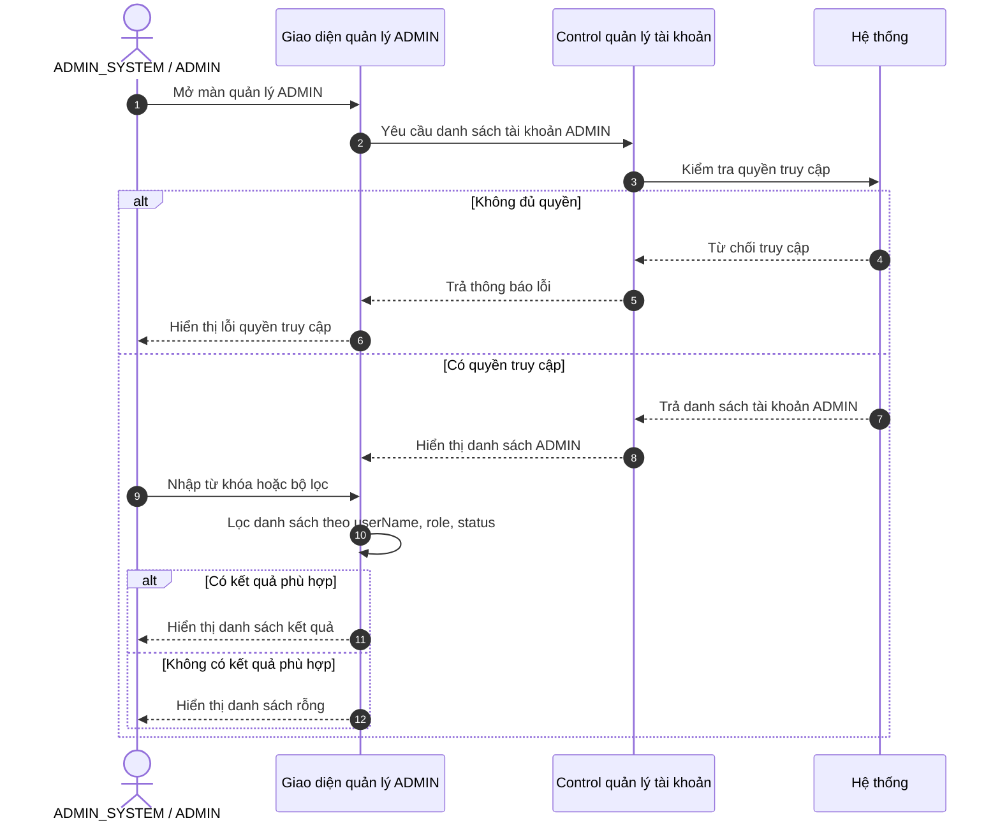

# Sơ đồ tuần tự - Tìm kiếm tài khoản ADMIN

Actors tham gia: `ADMIN_SYSTEM`, `ADMIN`.  
Actors không tham gia: `BUSINESS`, `WEBSITE USER`.

```mermaid
sequenceDiagram
autonumber

actor AdminActor as ADMIN_SYSTEM / ADMIN
participant AdminUI as Giao diện quản lý ADMIN
participant AdminControl as Control quản lý tài khoản
participant System as Hệ thống

AdminActor->>AdminUI: Mở màn quản lý ADMIN
AdminUI->>AdminControl: Yêu cầu danh sách tài khoản ADMIN
AdminControl->>System: Kiểm tra quyền truy cập

alt Không đủ quyền
  System-->>AdminControl: Từ chối truy cập
  AdminControl-->>AdminUI: Trả thông báo lỗi
  AdminUI-->>AdminActor: Hiển thị lỗi quyền truy cập
else Có quyền truy cập
  System-->>AdminControl: Trả danh sách tài khoản ADMIN
  AdminControl-->>AdminUI: Hiển thị danh sách ADMIN
  AdminActor->>AdminUI: Nhập từ khóa hoặc bộ lọc
  AdminUI->>AdminUI: Lọc danh sách theo userName, role, status

  alt Có kết quả phù hợp
    AdminUI-->>AdminActor: Hiển thị danh sách kết quả
  else Không có kết quả phù hợp
    AdminUI-->>AdminActor: Hiển thị danh sách rỗng
  end
end
```
