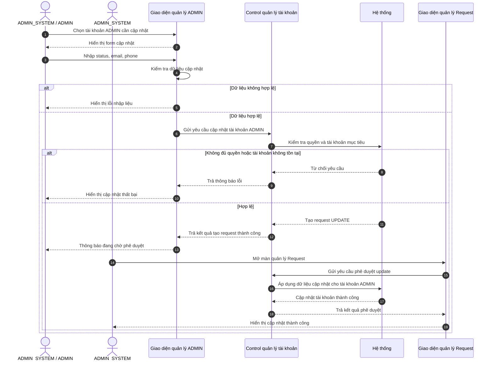

# Sơ đồ tuần tự - Cập nhật tài khoản ADMIN

Actors tham gia: `ADMIN_SYSTEM`, `ADMIN`.  
Actors không tham gia: `BUSINESS`, `WEBSITE USER`.

```mermaid
sequenceDiagram
autonumber

actor Requester as ADMIN_SYSTEM / ADMIN
actor AdminSystem as ADMIN_SYSTEM
participant AdminUI as Giao diện quản lý ADMIN
participant AdminControl as Control quản lý tài khoản
participant System as Hệ thống
participant RequestUI as Giao diện quản lý Request

Requester->>AdminUI: Chọn tài khoản ADMIN cần cập nhật
AdminUI-->>Requester: Hiển thị form cập nhật
Requester->>AdminUI: Nhập status, email, phone
AdminUI->>AdminUI: Kiểm tra dữ liệu cập nhật

alt Dữ liệu không hợp lệ
  AdminUI-->>Requester: Hiển thị lỗi nhập liệu
else Dữ liệu hợp lệ
  AdminUI->>AdminControl: Gửi yêu cầu cập nhật tài khoản ADMIN
  AdminControl->>System: Kiểm tra quyền và tài khoản mục tiêu

  alt Không đủ quyền hoặc tài khoản không tồn tại
    System-->>AdminControl: Từ chối yêu cầu
    AdminControl-->>AdminUI: Trả thông báo lỗi
    AdminUI-->>Requester: Hiển thị cập nhật thất bại
  else Hợp lệ
    System-->>AdminControl: Tạo request UPDATE
    AdminControl-->>AdminUI: Trả kết quả tạo request thành công
    AdminUI-->>Requester: Thông báo đang chờ phê duyệt

    AdminSystem->>RequestUI: Mở màn quản lý Request
    RequestUI->>AdminControl: Gửi yêu cầu phê duyệt update
    AdminControl->>System: Áp dụng dữ liệu cập nhật cho tài khoản ADMIN
    System-->>AdminControl: Cập nhật tài khoản thành công
    AdminControl-->>RequestUI: Trả kết quả phê duyệt
    RequestUI-->>AdminSystem: Hiển thị cập nhật thành công
  end
end
```
