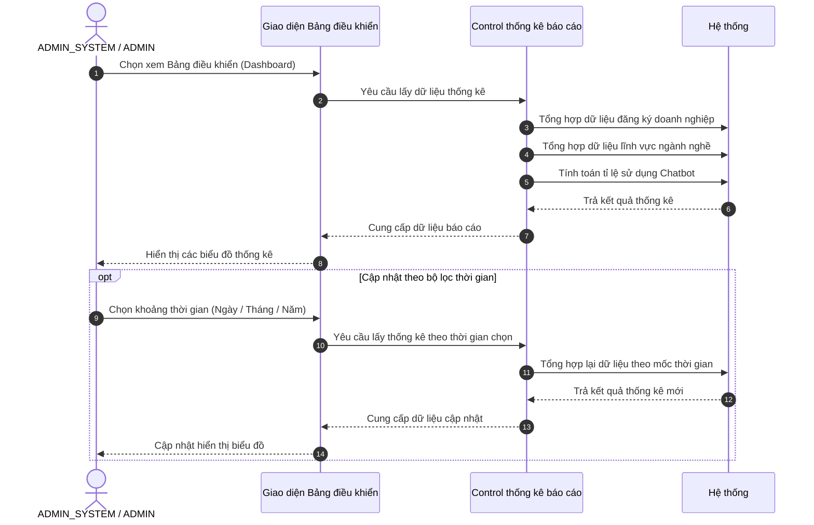

# Sơ đồ tuần tự - Quản lý xem báo cáo thống kê

Actors tham gia: `ADMIN_SYSTEM`, `ADMIN`.  
Actors không tham gia: `BUSINESS`, `WEBSITE USER`.

```mermaid
sequenceDiagram
autonumber

actor Requester as ADMIN_SYSTEM / ADMIN
participant DashboardUI as Giao diện Bảng điều khiển
participant DashboardControl as Control thống kê báo cáo
participant System as Hệ thống

Requester->>DashboardUI: Chọn xem Bảng điều khiển (Dashboard)
DashboardUI->>DashboardControl: Yêu cầu lấy dữ liệu thống kê
DashboardControl->>System: Tổng hợp dữ liệu đăng ký doanh nghiệp
DashboardControl->>System: Tổng hợp dữ liệu lĩnh vực ngành nghề
DashboardControl->>System: Tính toán tỉ lệ sử dụng Chatbot
System-->>DashboardControl: Trả kết quả thống kê
DashboardControl-->>DashboardUI: Cung cấp dữ liệu báo cáo
DashboardUI-->>Requester: Hiển thị các biểu đồ thống kê

opt Cập nhật theo bộ lọc thời gian
  Requester->>DashboardUI: Chọn khoảng thời gian (Ngày / Tháng / Năm)
  DashboardUI->>DashboardControl: Yêu cầu lấy thống kê theo thời gian chọn
  DashboardControl->>System: Tổng hợp lại dữ liệu theo mốc thời gian
  System-->>DashboardControl: Trả kết quả thống kê mới
  DashboardControl-->>DashboardUI: Cung cấp dữ liệu cập nhật
  DashboardUI-->>Requester: Cập nhật hiển thị biểu đồ
end
```
