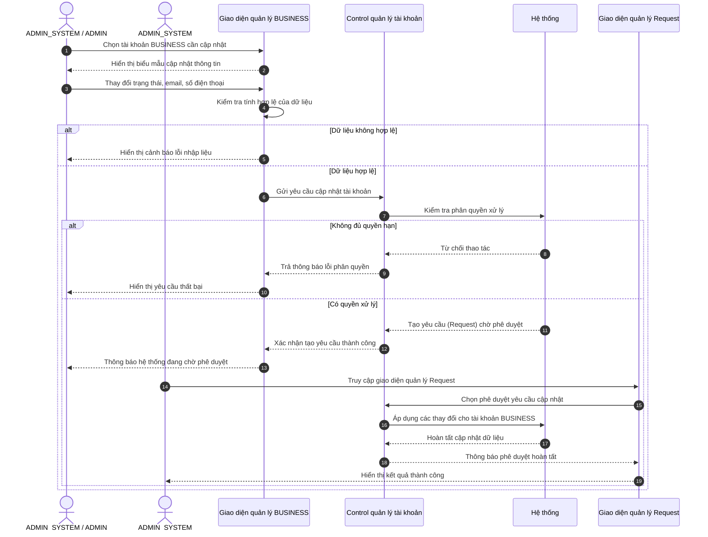

# Sơ đồ tuần tự - Cập nhật tài khoản BUSINESS

Actors tham gia: `ADMIN_SYSTEM`, `ADMIN`.  
Actors không tham gia: `BUSINESS`, `WEBSITE USER`.

```mermaid
sequenceDiagram
autonumber

actor Requester as ADMIN_SYSTEM / ADMIN
actor AdminSystem as ADMIN_SYSTEM
participant BusinessUI as Giao diện quản lý BUSINESS
participant BusinessControl as Control quản lý tài khoản
participant System as Hệ thống
participant RequestUI as Giao diện quản lý Request

Requester->>BusinessUI: Chọn tài khoản BUSINESS cần cập nhật
BusinessUI-->>Requester: Hiển thị biểu mẫu cập nhật thông tin
Requester->>BusinessUI: Thay đổi trạng thái, email, số điện thoại
BusinessUI->>BusinessUI: Kiểm tra tính hợp lệ của dữ liệu

alt Dữ liệu không hợp lệ
  BusinessUI-->>Requester: Hiển thị cảnh báo lỗi nhập liệu
else Dữ liệu hợp lệ
  BusinessUI->>BusinessControl: Gửi yêu cầu cập nhật tài khoản
  BusinessControl->>System: Kiểm tra phân quyền xử lý
  
  alt Không đủ quyền hạn
    System-->>BusinessControl: Từ chối thao tác
    BusinessControl-->>BusinessUI: Trả thông báo lỗi phân quyền
    BusinessUI-->>Requester: Hiển thị yêu cầu thất bại
  else Có quyền xử lý
    System-->>BusinessControl: Tạo yêu cầu (Request) chờ phê duyệt
    BusinessControl-->>BusinessUI: Xác nhận tạo yêu cầu thành công
    BusinessUI-->>Requester: Thông báo hệ thống đang chờ phê duyệt
    
    AdminSystem->>RequestUI: Truy cập giao diện quản lý Request
    RequestUI->>BusinessControl: Chọn phê duyệt yêu cầu cập nhật
    BusinessControl->>System: Áp dụng các thay đổi cho tài khoản BUSINESS
    System-->>BusinessControl: Hoàn tất cập nhật dữ liệu
    BusinessControl-->>RequestUI: Thông báo phê duyệt hoàn tất
    RequestUI-->>AdminSystem: Hiển thị kết quả thành công
  end
end
```
