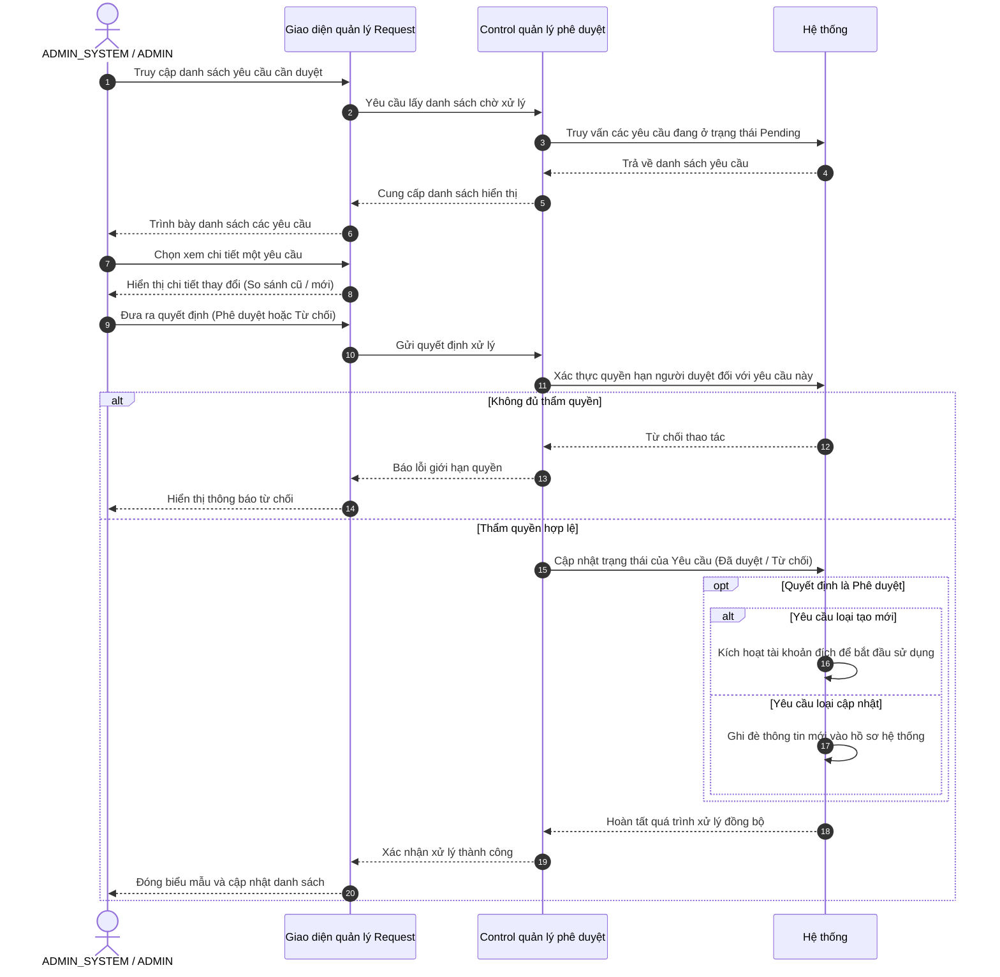

# Sơ đồ tuần tự - Phê duyệt yêu cầu (Maker-Checker)

Actors tham gia: `ADMIN_SYSTEM` (Duyệt mọi Request), `ADMIN` (Chỉ duyệt Request BUSINESS).  
Actors không tham gia: `BUSINESS`, `WEBSITE USER`.

