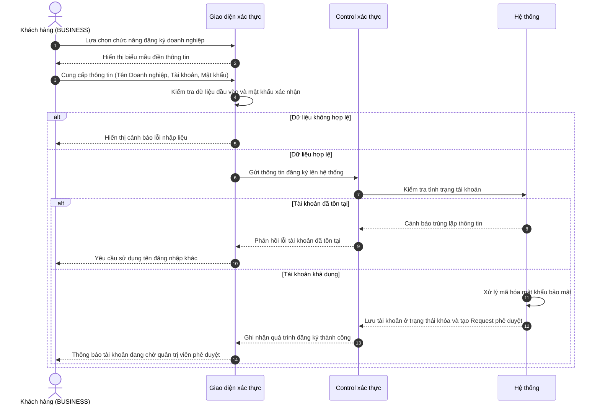

# Sơ đồ tuần tự - Đăng ký tài khoản BUSINESS

Actors tham gia: Khách hàng (Đại diện `BUSINESS`).  
Actors không tham gia: `ADMIN_SYSTEM`, `ADMIN`, `WEBSITE USER`.

```mermaid
sequenceDiagram
autonumber

actor Client as Khách hàng (BUSINESS)
participant AuthUI as Giao diện xác thực
participant AuthControl as Control xác thực
participant System as Hệ thống

Client->>AuthUI: Lựa chọn chức năng đăng ký doanh nghiệp
AuthUI-->>Client: Hiển thị biểu mẫu điền thông tin
Client->>AuthUI: Cung cấp thông tin (Tên Doanh nghiệp, Tài khoản, Mật khẩu)
AuthUI->>AuthUI: Kiểm tra dữ liệu đầu vào và mật khẩu xác nhận

alt Dữ liệu không hợp lệ
  AuthUI-->>Client: Hiển thị cảnh báo lỗi nhập liệu
else Dữ liệu hợp lệ
  AuthUI->>AuthControl: Gửi thông tin đăng ký lên hệ thống
  AuthControl->>System: Kiểm tra tình trạng tài khoản
  
  alt Tài khoản đã tồn tại
    System-->>AuthControl: Cảnh báo trùng lặp thông tin
    AuthControl-->>AuthUI: Phản hồi lỗi tài khoản đã tồn tại
    AuthUI-->>Client: Yêu cầu sử dụng tên đăng nhập khác
  else Tài khoản khả dụng
    System->>System: Xử lý mã hóa mật khẩu bảo mật
    System-->>AuthControl: Lưu tài khoản ở trạng thái khóa và tạo Request phê duyệt
    AuthControl-->>AuthUI: Ghi nhận quá trình đăng ký thành công
    AuthUI-->>Client: Thông báo tài khoản đang chờ quản trị viên phê duyệt
  end
end
```
