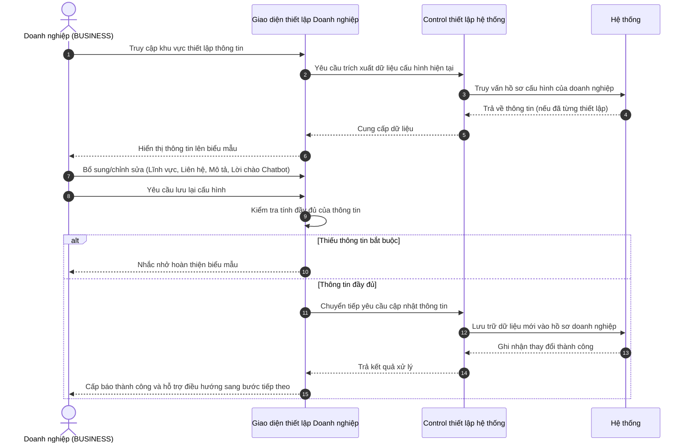

# Sơ đồ tuần tự - Cấu hình Chatbot (Thông tin doanh nghiệp)

Actors tham gia: `BUSINESS` (Đã đăng nhập).  
Actors không tham gia: `ADMIN_SYSTEM`, `ADMIN`, `WEBSITE USER`.

```mermaid
sequenceDiagram
autonumber

actor Biz as Doanh nghiệp (BUSINESS)
participant ConfigUI as Giao diện thiết lập Doanh nghiệp
participant ConfigControl as Control thiết lập hệ thống
participant System as Hệ thống

Biz->>ConfigUI: Truy cập khu vực thiết lập thông tin
ConfigUI->>ConfigControl: Yêu cầu trích xuất dữ liệu cấu hình hiện tại
ConfigControl->>System: Truy vấn hồ sơ cấu hình của doanh nghiệp
System-->>ConfigControl: Trả về thông tin (nếu đã từng thiết lập)
ConfigControl-->>ConfigUI: Cung cấp dữ liệu
ConfigUI-->>Biz: Hiển thị thông tin lên biểu mẫu

Biz->>ConfigUI: Bổ sung/chỉnh sửa (Lĩnh vực, Liên hệ, Mô tả, Lời chào Chatbot)
Biz->>ConfigUI: Yêu cầu lưu lại cấu hình
ConfigUI->>ConfigUI: Kiểm tra tính đầy đủ của thông tin

alt Thiếu thông tin bắt buộc
  ConfigUI-->>Biz: Nhắc nhở hoàn thiện biểu mẫu
else Thông tin đầy đủ
  ConfigUI->>ConfigControl: Chuyển tiếp yêu cầu cập nhật thông tin
  ConfigControl->>System: Lưu trữ dữ liệu mới vào hồ sơ doanh nghiệp
  System-->>ConfigControl: Ghi nhận thay đổi thành công
  ConfigControl-->>ConfigUI: Trả kết quả xử lý
  ConfigUI-->>Biz: Cấp báo thành công và hỗ trợ điều hướng sang bước tiếp theo
end
```
