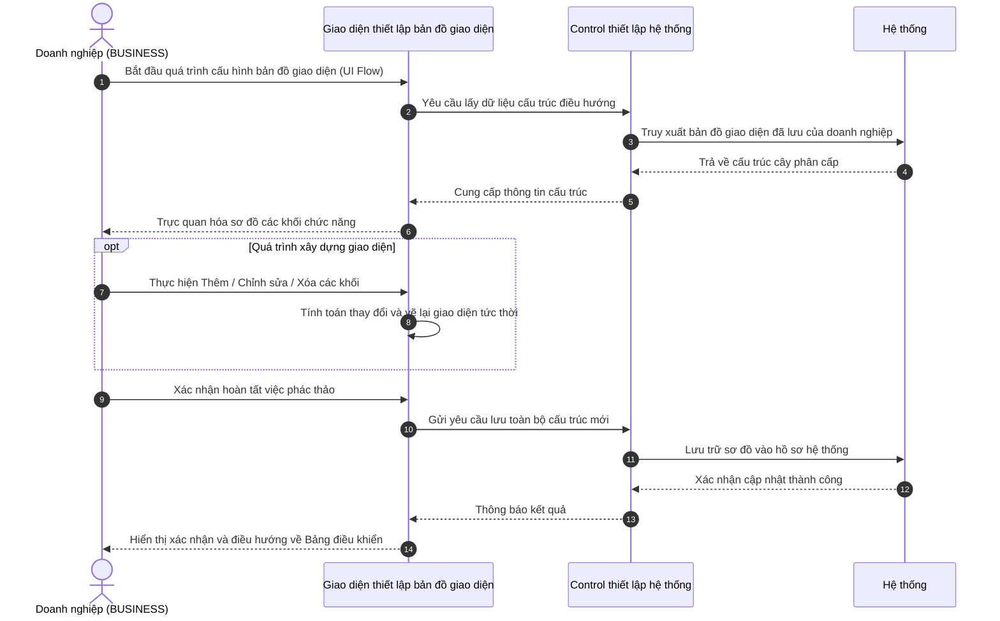

# Sơ đồ tuần tự - Cấu hình UI Flow

Actors tham gia: `BUSINESS` (Đã đăng nhập).  
Actors không tham gia: `ADMIN_SYSTEM`, `ADMIN`, `WEBSITE USER`.

```mermaid
sequenceDiagram
autonumber

actor Biz as Doanh nghiệp (BUSINESS)
participant FlowUI as Giao diện thiết lập bản đồ giao diện
participant FlowControl as Control thiết lập hệ thống
participant System as Hệ thống

Biz->>FlowUI: Bắt đầu quá trình cấu hình bản đồ giao diện (UI Flow)
FlowUI->>FlowControl: Yêu cầu lấy dữ liệu cấu trúc điều hướng
FlowControl->>System: Truy xuất bản đồ giao diện đã lưu của doanh nghiệp
System-->>FlowControl: Trả về cấu trúc cây phân cấp
FlowControl-->>FlowUI: Cung cấp thông tin cấu trúc
FlowUI-->>Biz: Trực quan hóa sơ đồ các khối chức năng

opt Quá trình xây dựng giao diện
  Biz->>FlowUI: Thực hiện Thêm / Chỉnh sửa / Xóa các khối
  FlowUI->>FlowUI: Tính toán thay đổi và vẽ lại giao diện tức thời
end

Biz->>FlowUI: Xác nhận hoàn tất việc phác thảo
FlowUI->>FlowControl: Gửi yêu cầu lưu toàn bộ cấu trúc mới
FlowControl->>System: Lưu trữ sơ đồ vào hồ sơ hệ thống
System-->>FlowControl: Xác nhận cập nhật thành công
FlowControl-->>FlowUI: Thông báo kết quả
FlowUI-->>Biz: Hiển thị xác nhận và điều hướng về Bảng điều khiển
```
