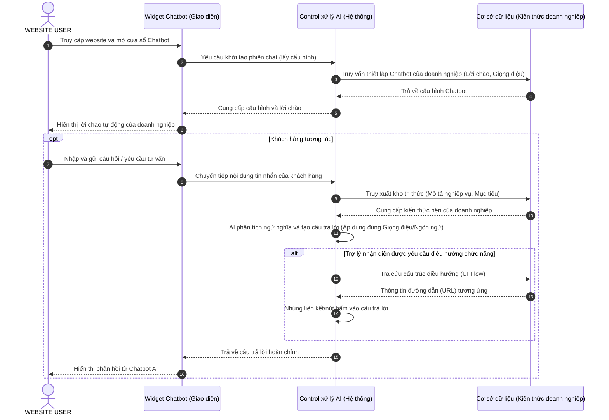

# Sơ đồ tuần tự - Tương tác Chatbot của WEBSITE USER

Actors tham gia: `WEBSITE USER` (Người dùng cuối trên website của doanh nghiệp).  
Actors không tham gia: `ADMIN_SYSTEM`, `ADMIN`, `BUSINESS`.

